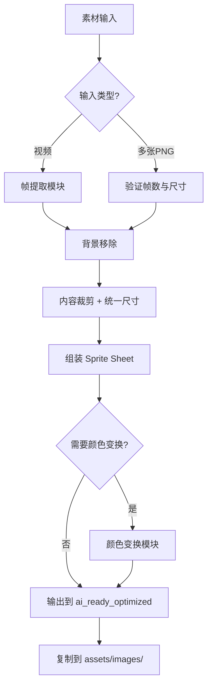

# AI AGENT RULES: ANIMATION TEXTURE PIPELINE
# AI 代理规则：动画纹理流水线

> [!TIP]
> **Pipeline Status**: ✅ IMPLEMENTED (2026-01-16, v3.0)
> - `scripts/process_image_strip.py` - ⭐图片条处理(推荐)
> - `scripts/process_timeline_video.py` - 时间线视频切割与音效提取
> - `scripts/process_animation_frames.py` - PNG序列组装
> - `scripts/color_transform.py` - 主题颜色变换
> - `scripts/preview_spritesheet.py` - Sprite Sheet预览

**CRITICAL INSTRUCTION TO AI ASSISTANTS (关键指令给AI助手)**:
当用户需要为游戏对象添加 4帧 或 16帧 动画纹理时，必须严格遵循本文档的流水线。

---

## 📋 目录

1. [概述与设计原则](#1-概述与设计原则)
2. [实体类型与动画模式](#2-实体类型与动画模式)
3. [素材输入规范](#3-素材输入规范)
4. [⭐图片生成模式(推荐)](#4-图片生成模式推荐)
5. [视频生成模式(备用)](#5-视频生成模式备用)
6. [帧提取与处理流程](#6-帧提取与处理流程)
7. [颜色变换系统](#7-颜色变换系统)
8. [命名规范](#8-命名规范)
9. [目录结构](#9-目录结构)
10. [Java集成指南](#10-java集成指南)
11. [交互协议](#11-交互协议)

---

## 1. 概述与设计原则

### 1.1 流水线目标
本流水线用于将 **循环动画素材** 转化为游戏可用的 **Sprite Sheet**，支持：
- ✅ 4帧动画 (适合简单循环：发光、摆动)
- ✅ 16帧动画 (适合复杂循环：火焰、水流、机械运转)
- ✅ 16+1帧动画 (16帧循环 + 1帧死亡/销毁状态)

### 1.2 设计原则 (Design Principles)

| 原则 | 说明 |
|------|------|
| **一致性 (Consistency)** | 与现有 `ASSET_PIPELINE_RULES_FOR_AI.md` 保持相同的目录结构和处理流程 |
| **主题适配 (Theme Adaptation)** | 所有动画必须符合5大主题风格：grassland, desert, ice, jungle, space |
| **幂等性 (Idempotency)** | 同一输入多次运行应产生相同输出 |
| **可追溯性 (Traceability)** | 保留原始素材和中间产物用于调试 |
| **风格统一 (Style Unity)** | 参考 `AI_TEXTURE_PROMPT_BIBLE.md` 确保视觉一致性 |

### 1.3 标准化规格 (Standardized Specifications) ⭐ 强制

> [!CAUTION]
> **以下规格为强制标准，外部生成时必须严格遵守！**

#### 1.3.1 图片尺寸规格

| 规格项 | 标准值 | 说明 |
|--------|--------|------|
| **单帧尺寸** | 128×128 px | 源图每帧尺寸 |
| **目标尺寸** | 64×64 px | 游戏内最终尺寸 |
| **⭐4帧条** | 512×128 px | **单行**4帧水平排列 ⚠️ 最常用！|
| **8帧网格** | 512×256 px | 4帧×2行 (仅用于多方向合成) |
| **16帧网格** | 512×512 px | 4帧×4行 (仅用于多方向合成) |

#### 1.3.2 辅助线规格

| 规格项 | 标准值 |
|--------|--------|
| **颜色** | 品红 #FF00FF (RGB 255,0,255) |
| **宽度** | 1-2 像素 |
| **位置** | 每帧正中心十字交叉 |
| **用途** | 确保物体居中对齐 |

#### 1.3.3 背景规格

| 规格项 | 标准值 |
|--------|--------|
| **颜色** | 纯白 #FFFFFF (RGB 255,255,255) |
| **禁止** | 灰色、渐变、纹理、透明 |

#### 1.3.4 物体填充规格

| 规格项 | 标准值 |
|--------|--------|
| **填充率** | 80% (物体占帧面积) |
| **边距** | 10% 每边 |
| **位置** | 居中于辅助线交叉点 |

#### 1.3.5 多视图网格行顺序 (Row Order Standard)

当一张图片包含多个方向视图时，**必须**按以下行顺序：

| 行号 | 内容 | 命名 |
|------|------|------|
| Row 0 | Right View (向右) | `walk_right` |
| Row 1 | Left View (向左) | `walk_left` |
| Row 2 | Down View (正面) | `walk_down` |
| Row 3 | Up View (背面) | `walk_up` |

#### 1.3.6 ⭐⭐⭐ 方向定义规范 (CRITICAL: Direction Specification)

> [!CAUTION]
> **这是最常被误解的规范！AI经常把 `walk_down` 误生成为侧面视图！**
> **必须在每个Prompt中强调以下坐标系和摄像机视角！**

##### 游戏坐标系 (Game Coordinate System)

```
                    NORTH (Y-)
                       ↑
                       │
          ┌────────────┼────────────┐
          │            │            │
   WEST   │            │            │   EAST
   (X-)   ← ───────────┼─────────── →   (X+)
          │            │            │
          │            │            │
          └────────────┼────────────┘
                       │
                       ↓
                    SOUTH (Y+)
                   (PLAYER)
```

##### 摄像机视角 (Camera = Player POV)

**摄像机位于 SOUTH (屏幕下方)，向 NORTH (上方) 观看。**

```
            屏幕上方 = NORTH = 远离玩家
                    ┌─────────┐
                    │  UP     │ ← 玩家看到怪物背面
                    │ (背面)  │
                    └─────────┘
                         ↑
     ┌─────────┐         │         ┌─────────┐
     │  LEFT   │ ←───────┼───────→ │  RIGHT  │
     │ (左侧)  │         │         │ (右侧)  │
     └─────────┘         ↓         └─────────┘
                    ┌─────────┐
                    │  DOWN   │ ← 玩家看到怪物正面!!!
                    │ (正面)  │
                    └─────────┘
            屏幕下方 = SOUTH = 面朝玩家
```

##### 每个方向的精确定义 ⭐⭐⭐

| 方向名 | 怪物朝向 | 玩家看到的视图 | Prompt关键词 (MUST USE!) |
|--------|----------|----------------|--------------------------|
| **DOWN** | 面朝摄像机/玩家 | **正面** (Front View): 看到脸、胸部、前腿 | `facing TOWARD the camera`, `front view`, `facing the viewer`, `looking at camera` |
| **UP** | 背对摄像机/玩家 | **背面** (Back View): 看到背部、尾巴、后腿 | `facing AWAY from camera`, `back view`, `rear view`, `showing its back` |
| **RIGHT** | 面朝屏幕右侧 | **右侧面** (Right Profile): 看到右侧身体轮廓 | `facing RIGHT`, `right side profile`, `side view facing right` |
| **LEFT** | 面朝屏幕左侧 | **左侧面** (Left Profile): 看到左侧身体轮廓 | `facing LEFT`, `left side profile`, `side view facing left` |

##### ⚠️ 最常见的方向错误

| 错误 | 常见原因 | 正确做法 |
|------|----------|----------|
| `walk_down` 生成了侧面 | Prompt没有强调 "facing camera" | 必须写 `facing TOWARD the camera (FRONT VIEW)` |
| `walk_down` 生成了俯视图 | AI把 "down" 理解为 "从上往下看" | 强调 `This is NOT a top-down view! The creature is FACING the camera!` |
| `walk_left` 和 `walk_right` 反了 | 混淆了 "怪物朝向" 和 "怪物位置" | 强调 `facing RIGHT means the creature's head points to the RIGHT of the image` |

##### Prompt中的强制方向声明 (Mandatory Direction Declaration)

**每个方向必须在Prompt中包含以下声明块**:

```text
=== DIRECTION DEFINITION (READ CAREFULLY!) ===
This animation is for: [walk_down / walk_up / walk_right / walk_left]

CAMERA POSITION: The camera is at the BOTTOM of the screen (South), looking UP (toward North).
- DOWN = Creature faces TOWARD the camera = FRONT VIEW (see face, chest, front legs)
- UP = Creature faces AWAY from camera = BACK VIEW (see back, tail, rear legs)
- RIGHT = Creature faces to the RIGHT of the image = RIGHT SIDE PROFILE
- LEFT = Creature faces to the LEFT of the image = LEFT SIDE PROFILE

⚠️ This is NOT a top-down bird's eye view! The camera is at ground level, looking horizontally!
```

##### 各方向的视觉检查清单 (Visual Checklist)

**生成图片后，按以下清单检查**:

| 方向 | 必须可见 | 必须不可见 |
|------|----------|------------|
| DOWN (正面) | ✅ 脸部/眼睛, ✅ 胸部/腹部, ✅ 前腿正面 | ❌ 尾巴, ❌ 背部脊椎 |
| UP (背面) | ✅ 背部/脊椎, ✅ 尾巴, ✅ 后腿背面 | ❌ 脸部, ❌ 眼睛 |
| RIGHT (右侧) | ✅ 右侧身体轮廓, ✅ 头朝右 | ❌ 左侧身体细节 |
| LEFT (左侧) | ✅ 左侧身体轮廓, ✅ 头朝左 | ❌ 右侧身体细节 |

---

#### 1.3.7 ⚠️ 单行强制约束 (Single Row Requirement) ⭐⭐⭐

> [!CAUTION]
> **这是最常见的生成错误！外部AI生成时经常生成多行图片！**

**强制规则**：

| 规则 | 描述 |
|------|------|
| **单一动作只能单行** | 生成 `walk_down` 等单个动作时，图片**必须只有1行** |
| **尺寸必须是 512×128** | 绝对不允许 512×256 或 512×512 等多行尺寸 |
| **只有4帧** | 图片中有且仅有 4 个帧，不能是 8 个或 16 个 |
| **不要复制角色** | 4帧应该是同一角色的4个动画阶段，不是2个角色 |

**Prompt 中必须明确声明**：
```
SINGLE ROW ONLY - Image MUST be exactly 512×128 pixels (4 columns × 1 row)
DO NOT create 2 rows, 8 frames, or any grid layout!
There should be EXACTLY 4 frames of the SAME character in different animation poses.
```

**在负面 Prompt (--no) 中添加**：
```
DO NOT: grid layout, 2 rows, 8 frames, 16 frames, multiple rows, duplicated character
```
---

#### 1.3.8 ⭐ 指定AI图像生成工具 (Designated AI Image Tool)

> [!IMPORTANT]
> **本项目专用工具：Google Nano Banana Pro (Gemini 3 Pro Image)**
> 所有动画素材均使用此工具生成，不使用其他工具。

##### 技术规格概览

| 特性 | 支持情况 | 说明 |
|------|----------|------|
| **长宽比** | 预设比例 | 1:1, 16:9, 9:16, 4:3, 3:4, 21:9 |
| **4:1 比例** | ❌ **不支持** | 最宽仅支持 21:9，需后期裁剪 |
| **负面提示词** | 接口依赖 | API支持；消费端需自然语言描述 |
| **自定义像素** | ❌ **不支持** | 只能选择 1K/2K/4K 档位 |

##### ⚠️ 关键限制：4:1 比例生成策略

> [!CAUTION]
> **Gemini 3 Pro Image 不支持 4:1 长宽比！**
> 必须使用 **21:9 生成 + 后期裁剪** 的两阶段工作流！

**两阶段工作流**:

```
阶段1: 生成 21:9 全景图 (约 2.33:1)
       ┌─────────────────────────────────────────────┐
       │         21:9 完整图像 (~4779×2048)          │
       │  ┌─────────────────────────────────────┐    │
       │  │     4:1 裁剪区域 (居中)              │    │
       │  └─────────────────────────────────────┘    │
       └─────────────────────────────────────────────┘

阶段2: 使用流水线脚本裁剪到 512×128 (4:1)
```

##### 分辨率档位系统 (Resolution Tiers)

| 档位 | 短边像素 | 21:9 输出 | 说明 |
|------|----------|-----------|------|
| **1K** | ~1024 | ~2389×1024 | 快速迭代，预览用 |
| **2K** | ~2048 | ~4779×2048 | ⭐推荐，平衡质量与速度 |
| **4K** | ~4096 | ~9557×4096 | 最高质量，商业打印 |

##### 负面提示词策略

> [!NOTE]
> **消费端界面（Gemini Advanced）无独立负面提示词输入框！**
> 必须将排除指令融入自然语言描述中。

**有效策略**：使用**肯定性描述**代替否定描述

| 避免 ❌ | 改用 ✅ |
|---------|---------|
| "不要蓝色天空" | "grey overcast sky" (灰色阴天) |
| "no grid layout" | "single horizontal row" |
| "don't show the back" | "facing toward the viewer, front view" |

**如果必须使用否定**：放在 Prompt 末尾，使用强指令词
```
EXCLUDE: grid layout, multiple rows, side view, back view
```

##### 简化Prompt策略 ⭐⭐⭐

> [!IMPORTANT]
> **核心原则：越简洁的Prompt效果越好！Gemini 会忽略技术规格！**

**✅ 有效的Prompt结构**:
```
[主体描述], [方向描述], [动画描述], [风格描述], [长宽比指令]
```

**❌ 无效的做法**:
- 指定精确像素尺寸（如 512×128）→ 会被忽略
- 使用 "sprite sheet" 关键词 → 会触发网格生成
- 冗长的技术说明和ASCII图表

**推荐用词**:

| 用途 | 推荐表达 |
|------|----------|
| 长宽比 | "ultra-wide panoramic, 21:9 aspect ratio" |
| 单行布局 | "single horizontal row, 4 poses side by side" |
| 正面视图 | "facing toward the viewer, front view, looking at camera" |

##### 两阶段生成命令

**阶段1**: 在 Gemini 中生成 21:9 图像，保存到 `raw_assets/images/`

**阶段2**: 使用流水线脚本裁剪和处理
```bash
# 从 21:9 裁剪到 4:1 并处理
python3 scripts/process_image_strip.py \
  --input raw_assets/images/boar_walk_down_21x9.png \
  --frames 4 \
  --crop-ratio 4:1 \
  --resize 512x128 \
  --name mob_boar_walk_down
```

> [!TIP]
> 在 Prompt 中使用 "panoramic composition with content centered" 确保主体在图像中央，便于裁剪时不丢失重要内容。

---

### 1.4 运动类型分类 (Locomotion Type Classification)

> [!IMPORTANT]
> 根据实体的运动方式选择对应的动画关键帧策略！

| 类型代码 | 类型名称 | 典型实体 | 关键帧策略 |
|----------|----------|----------|------------|
| **L0-NoLeg** | 无腿漂浮型 | 史莱姆、幽灵、UFO、能量球 | 挤压-拉伸循环 |
| **L2-Biped** | 双足型 | 人形、鸟类、企鹅 | 交替单腿前伸 |
| **L4-Quadruped** | 四足型 | 野猪、狗、猫、马 | 对角腿对交替 |
| **L6-Hexapod** | 六足型 | 昆虫、蜘蛛 | 三足波浪步态 |
| **LR-Roller** | 滚动型 | 轮子、坦克、滚球 | 旋转循环 |
| **LS-Static** | 静态型 | 陷阱、特效、装饰 | 脉动/闪烁循环 |

---

## 2. 实体类型与动画模式

> [!IMPORTANT]
> **灵活配置**：根据实体特性选择合适的动画模式，不是所有移动物体都需要8套动画！

### 2.1 三种动画模式

| 模式 | 描述 | 动画组数 | 典型实体 |
|------|------|---------|---------|
| **A. 方向敏感型** | 需要区分4个方向 | 4-8组 | 敌人、NPC、角色 |
| **B. 非方向敏感型** | 不区分方向，通用动画 | 1-2组 | 龙卷风、探照灯、外星飞船、能量球 |
| **C. 静态型** | 固定位置，仅循环动画 | 1组 | 陷阱、爆炸特效、雕塑、墙体装饰 |

---

### 2.2 模式A：方向敏感型 (敌人/NPC)

**根据需要选择动画组**：

| 动画组 | 是否必须 | 描述 |
|-------|---------|------|
| walk_down | ✅ 推荐 | 向下(朝向玩家)移动 |
| walk_right | ✅ 推荐 | 向右移动 |
| walk_up | ⬜ 可选 | 向上移动 (可用down翻转) |
| walk_left | ⬜ 可选 | 向左移动 (可用right翻转) |
| attack_down | ⬜ 可选 | 向下攻击 |
| attack_right | ⬜ 可选 | 向右攻击 |
| attack_up | ⬜ 可选 | 向上攻击 |
| attack_left | ⬜ 可选 | 向左攻击 |
| death | ⬜ 可选 | 死亡动画 |
| idle | ⬜ 可选 | 待机动画 |

**最小配置**: walk_down + walk_right (其他可翻转生成)
**标准配置**: 4方向移动
**完整配置**: 4方向移动 + 4方向攻击 + 死亡

---

### 2.3 模式B：非方向敏感型 (龙卷风/飞船/能量体)

**只需通用动画，不区分方向**：

| 动画组 | 用途 | 描述 |
|-------|------|------|
| move | 移动时播放 | 通用移动/漂浮动画 |
| attack | 攻击时播放 | 攻击/释放技能动画 |
| idle | 待机时播放 | 静止待机动画 (可选) |
| death | 被击杀时播放 | 消散/爆炸动画 (可选) |

**典型配置**: move + attack (2组动画即可)

---

### 2.4 模式C：静态型 (陷阱/特效/装饰)

**固定位置，仅循环动画**：

| 动画组 | 用途 | 示例 |
|-------|------|------|
| idle/loop | 常态循环 | 火焰陷阱燃烧、能量场脉动 |
| activate | 触发时播放 | 陷阱激活、机关启动 |
| explode | 爆炸效果 | 炸弹爆炸、水晶碎裂 |
| death | 销毁效果 | 墙体崩塌、雕塑倒塌 |

**典型配置**: idle (仅1组4帧循环)

---

### 2.5 应用场景速查表

| 实体 | 模式 | 建议动画组 |
|------|------|-----------|
| 野猪/敌人 | A-方向敏感 | walk×4 + attack×4 |
| 史莱姆 | A-方向敏感 | walk×2 (左右翻转) |
| 龙卷风 | B-非方向敏感 | move + attack |
| 探照灯 | B-非方向敏感 | move (旋转) + attack (锁定) |
| 外星飞船 | B-非方向敏感 | move + attack + death |
| 火焰陷阱 | C-静态 | idle (燃烧循环) |
| 爆炸特效 | C-静态 | explode (单次播放) |
| 能量雕塑 | C-静态 | idle (发光脉动) |
| 墙体装饰 | C-静态 | idle (轻微动效) |

---

### 2.6 音效配套规范 ⭐重要

> [!CAUTION]
> **每个动画组必须有对应的音效！**

| 动画组 | 对应音效 | 文件命名 |
|-------|---------|---------|
| walk/move | 移动音效 | `{entity}_move.ogg` |
| attack | 攻击音效 | `{entity}_attack.ogg` |
| death | 死亡音效 | `{entity}_death.ogg` |
| idle | 环境音(可选) | `{entity}_idle.ogg` |
| explode | 爆炸音效 | `{entity}_explode.ogg` |

**音效存放位置**: `assets/audio/sfx/entities/`

## 3. 素材输入规范

### 3.1 用户提供多张PNG时

**文件要求**:
- ✅ 透明背景 (Alpha Channel)
- ✅ 一致的尺寸 (所有帧大小相同)
- ✅ 按序命名或描述顺序

**命名建议** (非强制，但推荐):
```
frame_01.png, frame_02.png, ... frame_16.png
或
fire_1.png, fire_2.png, ... fire_4.png
```

**放置位置**:
```
raw_assets/animations/{entity_name}/frame_01.png
raw_assets/animations/{entity_name}/frame_02.png
...
```

### 3.2 用户提供视频时

**文件要求**:
- ✅ 循环流畅 (首尾帧视觉上可衔接)
- ✅ 主体清晰可辨
- ✅ 背景尽量纯净 (便于后期处理)

**放置位置**:
```
raw_assets/videos/{entity_name}.mp4
```

---

### 3.3 多行网格图片规范 (Standard Grid Layout) ⭐核心

当用户提供包含多行的合并大图时，**必须**严格遵循以下标准顺序：

**标准一：方向视图 (Sides/Views)**
如果一张图片包含不同视角的动画，**必须**按以下行顺序排列：

| 行号 (0-index) | 内容 | 对应文件名标记 | 备注 |
|---|---|---|---|
| Row 0 | **Right** View | `walk_right` / `attack_right` | 标准侧视图 |
| Row 1 | **Left** View | `walk_left` / `attack_left` | 镜像侧视图 |
| Row 2 | **Down** View (Front) | `walk_down` / `attack_down` | 正面视图 |
| Row 3 | **Up** View (Back) | `walk_up` / `attack_up` | 背面视图 |

**使用示例**：
```bash
# 处理包含 Right/Left 两行的图片
python3 scripts/process_image_strip.py \
  --input raw_assets/images/boar_sides.png \
  --rows 2 \
  --row-names "walk_right,walk_left"  <-- 必须匹配标准顺序
```

> [!CAUTION]
> **严禁反向！** 务必检查 Row 0 是向右，Row 1 是向左。如果原图反了，请在命令中互换参数，或者先编辑原图。

---

## 4. ⭐图片生成模式 (推荐)

> [!TIP]
> **推荐使用图片生成**：比视频生成省额度、质量更可控！

### 4.1 输入格式

**单张图片包含4帧**，水平排列：

```
┌─────────────────────────────────────────────────────────┐
│  Frame 1  │  Frame 2  │  Frame 3  │  Frame 4  │
│  128×128  │  128×128  │  128×128  │  128×128  │
└─────────────────────────────────────────────────────────┘
总尺寸: 512×128 px
```

**放置位置**:
```
raw_assets/images/{entity}_{animation}.png
例: raw_assets/images/boar_walk_down.png
```

---

### 4.2 品红辅助线系统 ⭐关键

> [!IMPORTANT]
> **辅助线用于确保4帧物体中心对齐！**

**规格**：
- 颜色：**品红 #FF00FF** (与任何游戏主题色差异最大)
- 宽度：1-2像素
- 位置：每帧正中心的十字线

```
┌─────────┬─────────┬─────────┬─────────┐
│    │    │    │    │    │    │    │    │
│ ───┼─── │ ───┼─── │ ───┼─── │ ───┼─── │  ← 品红十字线
│    │    │    │    │    │    │    │    │
│   🐗    │   🐗    │   🐗    │   🐗    │  ← 物体居中
└─────────┴─────────┴─────────┴─────────┘
```

**Prompt关键词**：
```
The creature must be CENTERED in every frame, same position across all 4 frames.
Fill about 80% of each frame (10% padding each side).
```

**处理脚本**会自动：
1. 按等分切割帧
2. 移除白色背景
3. 对齐物体中心

---

### 4.3 核心规则 (经验教训)

> [!CAUTION]
> **从测试中学到的关键教训**：
> 1. 背景必须是**绝对纯白 #FFFFFF** - 任何灰色都会导致边缘残留
> 2. 4帧之间的差异必须**肉眼明显可见** - 不能几乎一样
> 3. 图片必须是单行 512×128 像素 - 不能是多行网格

| 规则 | 正确 ✅ | 错误 ❌ | Prompt强调 |
|------|--------|--------|-----------|
| 背景 | **绝对纯白 #FFFFFF** | 灰色/渐变 | `PURE WHITE background, RGB(255,255,255), NO gray` |
| 帧差异 | **每帧明显不同** | 4帧几乎一样 | `Each frame VISIBLY DIFFERENT, obvious changes` |
| 位置 | 物体**正中央** | 位置偏移 | `CENTERED in every frame` |
| 大小 | 所有帧**完全一致** | 大小变化 | `SAME SIZE in all frames` |

---

### 4.4 ⭐⭐⭐ 逐帧动画规范系统 (Per-Frame Animation Specification)

> [!CAUTION]
> **AI图像生成器不会思考动画逻辑！必须在Prompt中精确描述每一帧的状态！**
> 以下规范确保生成的4帧能正确拼接成循环动画。

#### 循环动画的核心原则

```
帧序列: Frame 1 → Frame 2 → Frame 3 → Frame 4 → Frame 1 (循环)

关键要求:
1. Frame 4 必须能自然过渡回 Frame 1
2. 相邻帧之间的变化必须明显可见
3. 身体位置和大小必须保持一致，只有运动部件变化
```

---

#### 🦴 L4-Quadruped: 四足动物详细规范 (野猪、狗、马、狼)

> [!IMPORTANT]
> **对角步态 (Diagonal Trot)**: 对角线上的两条腿同步移动

##### 腿部命名标准

```
        正面视图 (walk_down)         侧面视图 (walk_left/right)
        
           ┌─────┐                      HEAD →
           │ HEAD│                    ┌─────────┐
           └──┬──┘                    │  BODY   │
              │                       └─┬─────┬─┘
        ┌─────┴─────┐                   │     │
        │   BODY    │               FL/BL   FR/BR
        └─┬───────┬─┘               (近侧)  (远侧)
          │       │
       FL─┴─FR FL─┴─FR
       BL   BR BL   BR
       
FL = Front-Left (左前腿)    FR = Front-Right (右前腿)
BL = Back-Left (左后腿)     BR = Back-Right (右后腿)
```

##### walk_down (正面视图) - 4帧逐帧规范

| 帧 | 对角对A (FR+BL) | 对角对B (FL+BR) | 视觉描述 |
|----|----------------|-----------------|----------|
| **Frame 1** | **前伸触地** | **后收抬起** | FR和BL向前伸展，蹄子接近地面；FL和BR向后收起，蹄子离开地面 |
| **Frame 2** | **收回经过** | **前移经过** | FR和BL从前方收回，经过身体下方；FL和BR从后方向前移动 |
| **Frame 3** | **后收抬起** | **前伸触地** | FR和BL向后收起，蹄子离开地面；FL和BR向前伸展，蹄子接近地面 |
| **Frame 4** | **前移经过** | **收回经过** | FR和BL从后方向前移动；FL和BR从前方收回，经过身体下方 |

**Prompt片段 (walk_down)**:
```
ANIMATION KEYFRAMES - Quadruped Diagonal Trot (FRONT VIEW):

Frame 1: Front-Right leg and Back-Left leg EXTENDED FORWARD (hooves near ground).
         Front-Left leg and Back-Right leg PULLED BACK (hooves lifted off ground).
         
Frame 2: Front-Right + Back-Left legs PASSING under body (mid-stride).
         Front-Left + Back-Right legs MOVING FORWARD from back position.
         
Frame 3: Front-Left leg and Back-Right leg EXTENDED FORWARD (hooves near ground).
         Front-Right leg and Back-Left leg PULLED BACK (hooves lifted off ground).
         
Frame 4: Front-Left + Back-Right legs PASSING under body (mid-stride).
         Front-Right + Back-Left legs MOVING FORWARD from back position.

LOOP: Frame 4 transitions back to Frame 1 seamlessly.
```

##### walk_right (右侧面视图) - 4帧逐帧规范

| 帧 | 近侧腿 (左侧对玩家) | 远侧腿 (右侧背对玩家) | 视觉描述 |
|----|---------------------|----------------------|----------|
| **Frame 1** | FL前伸, BL后收 | FR后收, BR前伸 | 左前腿向前伸展，右后腿向前伸展（X形） |
| **Frame 2** | FL收回, BL前移 | FR前移, BR收回 | 所有腿在交叉位置 |
| **Frame 3** | FL后收, BL前伸 | FR前伸, BR后收 | 左后腿向前伸展，右前腿向前伸展（X形） |
| **Frame 4** | FL前移, BL收回 | FR收回, BR前移 | 所有腿在交叉位置 |

**Prompt片段 (walk_right)**:
```
ANIMATION KEYFRAMES - Quadruped Trot (RIGHT SIDE PROFILE):

Frame 1: Near-side Front-Left leg FORWARD, Back-Left leg BACK.
         Far-side Front-Right leg BACK, Back-Right leg FORWARD.
         Creates an X-shape when viewed from side.
         
Frame 2: All legs crossing under body - transitional pose.
         Near-side legs moving toward opposite positions.
         
Frame 3: Near-side Front-Left leg BACK, Back-Left leg FORWARD.
         Far-side Front-Right leg FORWARD, Back-Right leg BACK.
         Creates opposite X-shape from Frame 1.
         
Frame 4: All legs crossing under body - transitional pose.
         Near-side legs moving toward Frame 1 positions.
```

##### walk_up (背面视图) - 同 walk_down 但看到背部/尾巴

##### walk_left (左侧面视图) - 同 walk_right 但镜像

---

#### 🧍 L2-Biped: 双足生物详细规范 (人形、鸟类、企鹅)

> [!IMPORTANT]
> **交替步态 (Alternating Step)**: 左右腿交替前后移动

##### 腿部命名标准

```
        正面视图              侧面视图
        
        ┌───┐                 ┌───┐
        │HEAD                 │   │ →
        ├───┤                 └─┬─┘
        │BODY                   │
        └─┬─┘                 ──┴──
          │                  L   R
       L──┴──R
       
L = Left Leg (左腿)    R = Right Leg (右腿)
```

##### walk_down (正面视图) - 4帧逐帧规范

| 帧 | 左腿 (L) | 右腿 (R) | 身体 | 视觉描述 |
|----|----------|----------|------|----------|
| **Frame 1** | **后收抬起** | **前伸触地** | 略右倾 | 右腿向前跨出，脚接触地面；左腿在后方抬起 |
| **Frame 2** | **经过中间** | **支撑站立** | 居中 | 左腿从后方经过身体下方；右腿垂直支撑 |
| **Frame 3** | **前伸触地** | **后收抬起** | 略左倾 | 左腿向前跨出，脚接触地面；右腿在后方抬起 |
| **Frame 4** | **支撑站立** | **经过中间** | 居中 | 右腿从后方经过身体下方；左腿垂直支撑 |

**Prompt片段 (walk_down)**:
```
ANIMATION KEYFRAMES - Biped Walk (FRONT VIEW):

Frame 1: RIGHT leg EXTENDED FORWARD, foot touching ground.
         LEFT leg PULLED BACK, foot lifted behind body.
         Body tilts slightly to the RIGHT.
         
Frame 2: RIGHT leg VERTICAL, supporting body weight.
         LEFT leg PASSING through mid-stride under body.
         Body centered, upright position.
         
Frame 3: LEFT leg EXTENDED FORWARD, foot touching ground.
         RIGHT leg PULLED BACK, foot lifted behind body.
         Body tilts slightly to the LEFT.
         
Frame 4: LEFT leg VERTICAL, supporting body weight.
         RIGHT leg PASSING through mid-stride under body.
         Body centered, upright position.
```

---

#### 🫧 L0-NoLeg: 无腿生物详细规范 (史莱姆、幽灵、UFO)

> [!IMPORTANT]
> **挤压-拉伸循环 (Squash-Stretch)**: 身体在垂直方向形变

##### 形变参数

| 帧 | 形状 | 高度 | 宽度 | 垂直位置 | 视觉描述 |
|----|------|------|------|----------|----------|
| **Frame 1** | **扁圆** | 80% | 120% | 最低 | 身体被压扁，像触地时的状态 |
| **Frame 2** | **正常** | 100% | 100% | 中间偏上 | 恢复正常形状，正在向上移动 |
| **Frame 3** | **瘦高** | 120% | 80% | 最高 | 身体被拉长，像弹跳到最高点 |
| **Frame 4** | **正常** | 100% | 100% | 中间偏下 | 恢复正常形状，正在向下落 |

**Prompt片段**:
```
ANIMATION KEYFRAMES - Legless Bounce/Float Cycle:

Frame 1: Body SQUASHED flat and wide (80% tall, 120% wide).
         Creature at LOWEST vertical position.
         Like a ball pressed against the ground.
         
Frame 2: Body returns to NORMAL proportions (100% × 100%).
         Creature RISING upward, mid-height position.
         
Frame 3: Body STRETCHED tall and thin (120% tall, 80% wide).
         Creature at HIGHEST vertical position.
         Like a ball at the peak of a bounce.
         
Frame 4: Body returns to NORMAL proportions (100% × 100%).
         Creature FALLING downward, mid-height position.

CRITICAL: The body CENTER must stay aligned! Only shape changes, not horizontal position!
```

---

#### 🕷️ L6-Hexapod: 六足生物详细规范 (昆虫、蜘蛛)

> [!IMPORTANT]
> **三足步态 (Tripod Gait)**: 三条腿同时移动，形成两个交替的三角形

##### 腿部命名和分组

```
          ┌─────┐
          │ HEAD│
          └──┬──┘
    L1 ────┤├──── R1  (前腿对)
    L2 ────┤├──── R2  (中腿对)  
    L3 ────┤├──── R3  (后腿对)
          └─────┘

三足组A (Tripod A): L1 + R2 + L3 (左前 + 右中 + 左后)
三足组B (Tripod B): R1 + L2 + R3 (右前 + 左中 + 右后)
```

##### 4帧逐帧规范

| 帧 | 三足组A (L1+R2+L3) | 三足组B (R1+L2+R3) | 视觉描述 |
|----|-------------------|-------------------|----------|
| **Frame 1** | **着地支撑** | **抬起移动** | A组三条腿接触地面；B组三条腿抬起 |
| **Frame 2** | **开始抬起** | **开始落下** | 两组腿在空中交错 |
| **Frame 3** | **抬起移动** | **着地支撑** | A组三条腿抬起；B组三条腿接触地面 |
| **Frame 4** | **开始落下** | **开始抬起** | 两组腿在空中交错 |

**Prompt片段**:
```
ANIMATION KEYFRAMES - Hexapod Tripod Gait:

Frame 1: Tripod A (Left-Front + Right-Middle + Left-Back) ON GROUND.
         Tripod B (Right-Front + Left-Middle + Right-Back) RAISED UP.
         Body supported by three alternating legs forming a triangle.
         
Frame 2: Tripod A legs LIFTING from ground.
         Tripod B legs LOWERING toward ground.
         All six legs in mid-air transition pose.
         
Frame 3: Tripod B (Right-Front + Left-Middle + Right-Back) ON GROUND.
         Tripod A (Left-Front + Right-Middle + Left-Back) RAISED UP.
         Opposite triangle now supports the body.
         
Frame 4: Tripod B legs LIFTING from ground.
         Tripod A legs LOWERING toward ground.
         All six legs in mid-air transition pose.
```

---

#### 🦅 LW-Winged: 有翅膀生物详细规范 (飞龙、鸟、蝙蝠)

> [!IMPORTANT]
> **翅膀拍动循环 (Wing Flap Cycle)**: 翅膀从最高点到最低点的完整周期

##### 翅膀位置参数

| 帧 | 翅膀角度 | 翅膀形态 | 身体高度 | 视觉描述 |
|----|----------|----------|----------|----------|
| **Frame 1** | **最高点 (UP)** | 展开伸直 | 最低 | 翅膀向上完全展开，准备下拍 |
| **Frame 2** | **下拍中 (MID-DOWN)** | 略微弯曲 | 上升中 | 翅膀正在向下拍动，产生升力 |
| **Frame 3** | **最低点 (DOWN)** | 弯曲收拢 | 最高 | 翅膀向下完成拍动，略微内收 |
| **Frame 4** | **上抬中 (MID-UP)** | 展开准备 | 下降中 | 翅膀正在向上抬起，准备下一拍 |

**Prompt片段**:
```
ANIMATION KEYFRAMES - Wing Flap Cycle:

Frame 1: Wings at HIGHEST position, fully extended upward.
         Wing tips point toward the sky.
         Body at LOWEST vertical position.
         
Frame 2: Wings SWEEPING DOWNWARD, slightly bent.
         Wings at 45° angle from horizontal.
         Body RISING due to lift generated.
         
Frame 3: Wings at LOWEST position, bent and tucked slightly.
         Wing tips point toward the ground.
         Body at HIGHEST vertical position.
         
Frame 4: Wings SWEEPING UPWARD, extending again.
         Wings at 45° angle from horizontal (opposite of Frame 2).
         Body FALLING as it prepares for next flap.

CRITICAL: Wing positions must mirror left-right! Both wings move together!
```

##### 飞行方向变体

| 方向 | 翅膀可见性 | 身体角度 |
|------|------------|----------|
| **fly_down** (正面) | 两翅膀完全可见，前缘朝上 | 面朝玩家俯冲 |
| **fly_up** (背面) | 两翅膀完全可见，后缘朝上 | 背对玩家上升 |
| **fly_right** (右侧) | 右翅膀完全可见，左翅膀部分/不可见 | 侧面飞行 |
| **fly_left** (左侧) | 左翅膀完全可见，右翅膀部分/不可见 | 侧面飞行 |

---

#### 🔄 LC-Rotation: 旋转物体详细规范 (齿轮、风扇、雷达)

| 帧 | 旋转角度 | 标记位置 | 视觉描述 |
|----|----------|----------|----------|
| **Frame 1** | **0°** | 12点钟 | 参考标记在正上方 |
| **Frame 2** | **90°** | 3点钟 | 标记旋转到右侧 |
| **Frame 3** | **180°** | 6点钟 | 标记旋转到正下方 |
| **Frame 4** | **270°** | 9点钟 | 标记旋转到左侧 |

**Prompt片段**:
```
ANIMATION KEYFRAMES - 90° Rotation Cycle:

Frame 1: Object at 0° (reference marking at TOP, 12 o'clock).
Frame 2: Object rotated 90° clockwise (marking at RIGHT, 3 o'clock).
Frame 3: Object rotated 180° (marking at BOTTOM, 6 o'clock).
Frame 4: Object rotated 270° clockwise (marking at LEFT, 9 o'clock).

CRITICAL: Object MUST have visible asymmetric feature to show rotation!
```

---

#### 💫 LP-Pulse: 脉动效果详细规范 (能量球、魔法阵、水晶)

| 帧 | 亮度 | 尺寸 | 粒子效果 | 视觉描述 |
|----|------|------|----------|----------|
| **Frame 1** | **25%** | 95% | 最少 | 最暗最小状态 |
| **Frame 2** | **60%** | 100% | 增加中 | 正在变亮变大 |
| **Frame 3** | **100%** | 105% | 最多 | 最亮最大状态 |
| **Frame 4** | **60%** | 100% | 减少中 | 正在变暗变小 |

---

### 4.5 动画类型速查表

| 类型代码 | 类型名称 | 典型实体 | 变化维度 | Prompt关键词 |
|----------|----------|----------|----------|--------------|
| **L4** | 四足动物 | 野猪、狗、马、狼 | 对角腿交替 | `diagonal trot, FR+BL then FL+BR` |
| **L2** | 双足生物 | 人形、鸟类、企鹅 | 左右腿交替 | `alternating step, L then R` |
| **L0** | 无腿生物 | 史莱姆、幽灵、UFO | 挤压-拉伸 | `squash-stretch, 80%-100%-120%-100%` |
| **L6** | 六足生物 | 昆虫、蜘蛛 | 三足组交替 | `tripod gait, L1+R2+L3 then R1+L2+R3` |
| **LW** | 有翅膀 | 飞龙、鸟、蝙蝠 | 翅膀拍动 | `wing flap, UP-DOWN-UP-DOWN` |
| **LC** | 旋转物体 | 齿轮、风扇、雷达 | 90°旋转 | `rotation, 0°-90°-180°-270°` |
| **LP** | 脉动效果 | 能量球、水晶 | 亮度+尺寸 | `pulse, dim-bright-dim` |
| **LF** | 火焰/流体 | 火焰、烟雾 | 形态变化 | `flicker, shape A-B-C-D` |
| **LA** | 攻击动作 | 冲撞、挥砍 | 动作阶段 | `attack, windup-strike-impact-recover` |

> [!TIP]
> 以下模板按运动类型分类，复制后替换 `[占位符]` 即可使用。

> [!CAUTION]
> **关键约束：每个 Prompt 都必须包含以下内容！**
> 1. 21:9 长宽比 (Gemini 3 限制)
> 2. 单行4帧布局
> 3. 完整的逐帧动画描述

---

#### 4.5.0 ⭐ 怪物设计美学风格 (Creature Design Style Guide)

> [!TIP]
> **让怪物更具奇幻创意感，同时保持像素风！**

| 风格维度 | 描述 | 示例关键词 |
|----------|------|------------|
| **奇幻 (Fantasy)** | 夸张的比例、魔法元素、神秘符文 | `mystical runes, glowing eyes, ethereal aura, ancient magic` |
| **创意 (Creative)** | 独特的形态、非常规配色、混合生物 | `chimera fusion, unusual mutations, vivid colors, hybrid creature` |
| **像素风 (Pixel Art)** | 清晰边缘、有限调色板、复古游戏感 | `16-bit, SNES RPG, crisp edges, limited palette, retro game sprite` |
| **威胁感 (Menacing)** | 刳、尖角、玉彩发光、攻击性外观 | `sharp tusks, glowing veins, aggressive stance, battle scars` |

**怪物设计 Prompt 片段**：
```
=== CREATURE DESIGN STYLE ===
- Fantasy/Mystical: Add magical elements like glowing patterns, ethereal particles
- Creative/Unique: Unusual body proportions, hybrid features, unexpected details
- Threatening: Sharp edges, battle damage, aggressive expression
- Pixel Art Quality: Crisp edges, limited 24-color palette, retro SNES/GBA aesthetic
- NOT a realistic animal - it's a FANTASY GAME CREATURE!
```

**不同主题的怪物风格建议**：

| 主题 | 怪物风格建议 | 配色建议 |
|------|----------------|----------|
| Grassland | 森林精灵、古树角、苗单、发光花纹 | 翠绿+金棕+发光黄 |
| Desert | 沙岩甲壳、熊熊火焰纹路、晶体装饰 | 砂金+熔岩橙+焰红 |
| Ice | 寒冰结晶、霜雾光环、动态冰裂纹 | 冰蓝+冰白+紫光 |
| Jungle | 生物发光、藤蔓缠绕、毒液 spores | 深绿+霍光紫+毒绿 |
| Space | 全息投影、能量护盾、机械元件 | 霉紫+电青+银金属 |

#### 模板 L4: 四足动物 (Quadruped - 野猪、狗、马)

> [!TIP]
> **使用说明**: 复制整个模板，然后：
> 1. 选择对应的 `=== DIRECTION: xxx ===` 块（只保留一个方向）
> 2. 替换 `[占位符]` 内容
> 3. 删除其他方向的块

```
4-FRAME ANIMATION SPRITE STRIP - [动物名] [walk_down/walk_up/walk_right/walk_left]

Create a SINGLE image containing 4 animation frames arranged horizontally.

=== ⚠️ IMAGE SPECIFICATION (NON-NEGOTIABLE!) ===
┌──────────────────────────────────────────────────────────────┐
│ TOTAL SIZE: EXACTLY 512 pixels wide × 128 pixels tall        │
│ LAYOUT: 4 frames in a SINGLE HORIZONTAL ROW                  │
│ EACH FRAME: Exactly 128×128 pixels                           │
│ BACKGROUND: Pure white #FFFFFF - NO gray, NO gradient        │
│ FRAME COUNT: EXACTLY 4 - not 2, not 8, not 16                │
└──────────────────────────────────────────────────────────────┘
FORBIDDEN: 2 rows, grid layout, 8 frames, 512×256, 512×512

=== ⭐⭐⭐ DIRECTION DEFINITION (CRITICAL - READ BEFORE GENERATING!) ===

This is a 2D top-down game viewed from the PLAYER'S perspective.
The camera is at the BOTTOM of the screen, looking UPWARD.

>>> CHOOSE ONE DIRECTION BELOW AND DELETE THE OTHERS: <<<

--- DIRECTION: walk_down (正面/FRONT VIEW) ---
The creature is facing TOWARD THE CAMERA (toward the player/viewer).
VISIBLE: Face, eyes, chest/belly, front of all 4 legs, tusks pointing toward viewer.
NOT VISIBLE: Tail, back spine, rear view.
CAMERA ANGLE: The creature is looking directly at you!
PROMPT KEYWORDS: "facing toward the camera", "front view", "facing the viewer", "looking at camera", "frontal pose"
⚠️ This is NOT a side view! NOT a top-down birds-eye view!

--- DIRECTION: walk_up (背面/BACK VIEW) ---
The creature is facing AWAY FROM THE CAMERA (away from the player).
VISIBLE: Back, spine, tail, rear of all 4 legs, back of head/ears.
NOT VISIBLE: Face, eyes, chest, tusks.
CAMERA ANGLE: You are looking at the creature's back!
PROMPT KEYWORDS: "facing away from camera", "back view", "rear view", "showing its back", "walking away"

--- DIRECTION: walk_right (右侧面/RIGHT PROFILE) ---
The creature is facing to the RIGHT side of the image.
The creature's HEAD points to the RIGHT edge of the image.
VISIBLE: Right side body profile, right legs, head pointing right.
CAMERA ANGLE: Side profile, head on the right side of the body.
PROMPT KEYWORDS: "facing right", "right side profile", "side view facing right", "head pointing right"

--- DIRECTION: walk_left (左侧面/LEFT PROFILE) ---
The creature is facing to the LEFT side of the image.
The creature's HEAD points to the LEFT edge of the image.
VISIBLE: Left side body profile, left legs, head pointing left.
CAMERA ANGLE: Side profile, head on the left side of the body.
PROMPT KEYWORDS: "facing left", "left side profile", "side view facing left", "head pointing left"

=== POSITION REQUIREMENTS ===
1. Creature CENTERED in every frame - same position, same size
2. Creature fills 80% of each frame (10% padding each side)
3. NO actual movement - creature stays in place, only legs animate
4. All 4 frames show the SAME creature, same facing direction

=== ANIMATION KEYFRAMES (Quadruped Diagonal Trot Cycle) ===
Frame 1: Front-right + Back-left legs forward, Front-left + Back-right legs back (Diagonal A Contact)
Frame 2: Front-right + Back-left passing through neutral (Diagonal A Passing)
Frame 3: Front-left + Back-right legs forward, Front-right + Back-left legs back (Diagonal B Contact)
Frame 4: Front-left + Back-right passing through neutral (Diagonal B Passing)
Loop 1→2→3→4→1 creates smooth trotting animation.
Each frame must show VISIBLE leg position difference!

=== CREATURE DESIGN ([主题] FANTASY STYLE) ===
[动物名] - [简短描述], 16-bit pixel art, SNES/GBA RPG sprite style.
- This is a FANTASY GAME CREATURE, not a realistic animal!
- Mystical elements: [发光眼睛/魔法纹路/灵气效果]
- Theme colors: [主色], [辅色], [发光色] (24-color limited palette)
- Features: [獠牙/角/鬃毛等特征描述]
- Style: Threatening but stylized, battle-ready appearance

=== VISUAL VERIFICATION CHECKLIST (Check after generation!) ===
□ Image is exactly 512×128 pixels (4:1 ratio)
□ Only 1 row, exactly 4 frames
□ Background is pure white
□ Creature faces the correct direction (see DIRECTION section above!)
□ All 4 frames show visible leg movement differences
□ No black borders, no grid lines

--no 3D, photorealism, photograph, blur, anti-aliasing, smooth gradients, gradient background, textured background, gray background, actual movement, walking across frame, 2 rows, 8 frames, 16 frames, grid layout, sprite sheet grid, multiple creatures, duplicated character, side view when front view requested, realistic animal, top-down view, birds eye view
```

---

#### 模板 L2: 双足生物 (Biped - 人形、鸟类)

```
4-FRAME ANIMATION SPRITE STRIP - [生物名] [动作] [方向]

Create a SINGLE image containing 4 animation frames arranged horizontally.

=== ⚠️ ABSOLUTE SIZE REQUIREMENT (MOST IMPORTANT!) ===
Total image size: EXACTLY 512×128 pixels (4 columns × 1 row)
SINGLE ROW ONLY - DO NOT create 2 rows or grid layout!

=== LAYOUT ===
[Frame 1] | [Frame 2] | [Frame 3] | [Frame 4]
Each frame is exactly 128×128 pixels, square.

=== CRITICAL REQUIREMENTS ===
1. Pure WHITE #FFFFFF background - NO gradients, NO textures
2. Creature must be CENTERED in EVERY frame
3. Creature must be EXACTLY SAME SIZE in all 4 frames
4. Creature has TWO LEGS only
5. ⚠️ SINGLE ROW, 4 FRAMES ONLY!

=== ANIMATION KEYFRAMES (Biped Walk Cycle) ===
- Frame 1: Right leg forward touching ground, left leg back lifted (Contact Right)
- Frame 2: Right leg flat, left leg passing through mid-stride (Passing Right)
- Frame 3: Left leg forward touching ground, right leg back lifted (Contact Left)
- Frame 4: Left leg flat, right leg passing through mid-stride (Passing Left)
Loop 1→2→3→4→1 creates smooth bipedal walking animation.

=== CREATURE DESIGN (FANTASY STYLE!) ===
[生物描述], 16-bit pixel art style.
- Fantasy game creature, not realistic!
- Add magical/mystical visual elements
[颜色和特征描述].
Creature fills about 80% of each frame.

--no 3D, photorealism, blur, anti-aliasing, gradient background
```

---

#### 模板 L0: 无腿生物 (NoLeg - 史莱姆、幽灵、UFO)

```
4-FRAME ANIMATION SPRITE STRIP - [生物名] [动作]

Create a SINGLE image containing 4 animation frames arranged horizontally.

=== ⚠️ ABSOLUTE SIZE REQUIREMENT (MOST IMPORTANT!) ===
Total image size: EXACTLY 512×128 pixels (4 columns × 1 row)
SINGLE ROW ONLY - DO NOT create 2 rows, 8 frames, or grid layout!

=== LAYOUT ===
[Frame 1] | [Frame 2] | [Frame 3] | [Frame 4]
Each frame is exactly 128×128 pixels, square.

=== CRITICAL REQUIREMENTS ===
1. Pure WHITE #FFFFFF background
2. Creature must be CENTERED in EVERY frame
3. THIS CREATURE HAS NO LEGS - it floats/bounces
4. ⚠️ SINGLE ROW, 4 FRAMES ONLY!

=== ANIMATION KEYFRAMES (Bounce/Float Cycle) ===
- Frame 1: Body SQUASHED horizontally (wider, shorter) - touching ground
- Frame 2: Body returns to normal shape, moving UPWARD
- Frame 3: Body STRETCHED vertically (taller, thinner) - at peak height
- Frame 4: Body returns to normal shape, moving DOWNWARD
Loop 1→2→3→4→1 creates smooth bouncing/hovering animation.
Each frame should show VISIBLE shape difference!

=== CREATURE DESIGN (FANTASY STYLE!) ===
[生物描述], 16-bit pixel art style.
[颜色描述], semi-transparent/gelatinous appearance.
- Add mystical glow effects and magical particles
Creature fills about 80% of each frame.

--no 3D, photorealism, blur, legs, feet, walking motion, 2 rows, 8 frames, grid layout
```

---

#### 模板 L6: 六足生物 (Hexapod - 昆虫、蜘蛛)

```
4-FRAME ANIMATION SPRITE STRIP - [生物名] [动作] [方向]

Create a SINGLE image containing 4 animation frames arranged horizontally.

=== ⚠️ ABSOLUTE SIZE REQUIREMENT (MOST IMPORTANT!) ===
Total image size: EXACTLY 512×128 pixels (4 columns × 1 row)
SINGLE ROW ONLY - DO NOT create 2 rows or grid layout!

=== CRITICAL REQUIREMENTS ===
1. Pure WHITE #FFFFFF background
2. Creature must be CENTERED in EVERY frame
3. Creature has SIX LEGS (3 pairs)
4. ⚠️ SINGLE ROW, 4 FRAMES ONLY!

=== ANIMATION KEYFRAMES (Tripod Gait Cycle) ===
- Frame 1: Tripod A down (front-left, mid-right, back-left), Tripod B up
- Frame 2: Transition - legs moving
- Frame 3: Tripod B down (front-right, mid-left, back-right), Tripod A up
- Frame 4: Transition - legs moving back
This creates the characteristic insect "tripod gait" animation.

=== CREATURE DESIGN (FANTASY STYLE!) ===
[昆虫描述], 16-bit pixel art style.
[颜色描述], segmented body, visible leg joints.
- Add bioluminescent elements and unusual patterns

--no 3D, photorealism, blur, anti-aliasing, 2 rows, 8 frames, grid layout
```

---

#### 模板 LR: 滚动物体 (Roller - 轮子、滚球)

```
4-FRAME ANIMATION SPRITE STRIP - [物体名] Rolling

Create a SINGLE image containing 4 animation frames arranged horizontally.

=== ⚠️ ABSOLUTE SIZE REQUIREMENT ===
Total image size: EXACTLY 512×128 pixels
SINGLE ROW ONLY - DO NOT create 2 rows or grid layout!

=== ANIMATION KEYFRAMES (90° Rotation Cycle) ===
- Frame 1: 0° rotation (reference position)
- Frame 2: 90° clockwise rotation
- Frame 3: 180° rotation (upside down)
- Frame 4: 270° rotation
Loop 1→2→3→4→1 creates smooth 360° rolling animation.

=== SUBJECT ===
[物体描述], 16-bit pixel art style.
MUST have visible surface markings to show rotation clearly!

--no blur, motion blur, 3D rendering, 2 rows, 8 frames, grid layout
```

---

#### 模板 LS: 静态效果 (Static - 陷阱、光效)

```
4-FRAME ANIMATION SPRITE STRIP - [效果名] Pulsing

Create a SINGLE image containing 4 animation frames arranged horizontally.

=== ⚠️ ABSOLUTE SIZE REQUIREMENT ===
Total image size: EXACTLY 512×128 pixels
SINGLE ROW ONLY - DO NOT create 2 rows or grid layout!

=== ANIMATION KEYFRAMES (Pulse Cycle) ===
- Frame 1: Normal size, normal glow intensity
- Frame 2: Slightly larger (105%), brighter glow
- Frame 3: Maximum size (110%), brightest glow
- Frame 4: Slightly larger (105%), brighter glow (same as Frame 2)
Loop 1→2→3→4→1 creates smooth pulsing animation.

=== SUBJECT ===
[效果描述], 16-bit pixel art style.
[发光/颜色描述].

--no blur, 3D rendering, 2 rows, 8 frames, grid layout
```

---

### 4.6 处理命令

**生成图片后执行**：

```bash
# 基础用法（单行图片条）
python3 scripts/process_image_strip.py \
  --input raw_assets/images/boar_walk_down.png \
  --frames 4 \
  --name mob_boar_walk_down

# 带辅助线检测 + 邻域修复
python3 scripts/process_image_strip.py \
  --input raw_assets/images/boar_walk_down.png \
  --frames 4 \
  --guide-color "#FF00FF" \
  --name mob_boar_walk_down

# ⭐ 推荐：多视图网格 + Canvas缩放（保持比例）
python3 scripts/process_image_strip.py \
  --input raw_assets/images/boar_walk_sides.png \
  --frames 4 \
  --rows 2 \
  --row-names "walk_right,walk_left" \
  --scale-mode canvas \
  --guide-color "#FF00FF" \
  --name mob_boar

# 4行网格（上下左右全套）
python3 scripts/process_image_strip.py \
  --input raw_assets/images/boar_walk_all.png \
  --frames 4 \
  --rows 4 \
  --row-names "walk_right,walk_left,walk_down,walk_up" \
  --scale-mode canvas \
  --guide-color "#FF00FF" \
  --name mob_boar
```

> [!IMPORTANT]
> **多视图资源必须使用 `--scale-mode canvas`** 以保持不同方向之间的相对比例一致！

---

## 5. 视频生成模式 (备用)

当用户无现成素材，需要 AI 生成动画视频时，使用以下工作流。

> [!IMPORTANT]
> **时间线切割原则**：视频按时间顺序依次展示各动画状态，脚本按时间戳切割提取帧，而非空间Grid切割！

### 4.1 触发条件
用户说：**"我需要一个 [主题] 风格的 [物品名/怪物名] 动画"** 或类似表述。

### 4.2 确认动画需求

AI必须与用户确认：
1. **动画模式**: A/B/C (方向敏感/非方向敏感/静态)
2. **需要哪些动画组**: 如 move + attack，或 walk×4 + attack×4
3. **每组帧数**: 通常4帧
4. **是否需要音效**: 是

---

### 4.3 时间线布局规范 ⭐核心

**视频时间线结构**：各动画组按时间顺序排列，每组之间有明确的视觉分隔标记。

```
视频时间线 (Timeline):
┌────────────────────────────────────────────────────────────────────┐
│ 0s      1s      2s      3s      4s      5s      6s      7s      8s │
├────────┬───────┬───────┬───────┬───────┬───────┬───────┬──────────┤
│ walk_dn│walk_rt│walk_up│walk_lt│atk_dn │atk_rt │atk_up │ atk_lt   │
│ 4帧    │ 4帧   │ 4帧   │ 4帧   │ 4帧   │ 4帧   │ 4帧   │ 4帧      │
└────────┴───────┴───────┴───────┴───────┴───────┴───────┴──────────┘
每秒约4帧 = 每个动画组约1秒时长
```

**时间戳标记系统**：
- 每个动画组开始时，画面左上角显示文字标记
- 格式：`[动画组名称]` 例如 `[WALK_DOWN]`, `[ATTACK]`, `[MOVE]`
- 标记持续约0.5秒后消失，帧正式开始

---

### 4.4 风格锚定关键词

```text
16-bit pixel art style, retro SNES RPG aesthetic, 
game sprite animation, limited color palette (max 16 colors), 
crisp pixel edges, no anti-aliasing, no blur,
top-down 3/4 perspective view,
[Theme Keywords]
```

**主题关键词**：

| 主题 | 颜色和风格 |
|------|-----------|
| Grassland | Forest green, earthy brown, sunlit warm tones |
| Desert | Sand gold, terracotta, heat wave effect |
| Ice | Crystal cyan, frost white, cold blue shimmer |
| Jungle | Deep emerald, bioluminescent purple, misty |
| Space | Neon cyan, electric purple, chrome metallic |

---

### 4.5 音效生成规范 ⭐重要

> [!CAUTION]
> **视频必须包含对应音效，音轨与动画同步！**

**Prompt中必须声明**：
```text
Include sound effects for each animation state, synchronized with visuals.
NO background music, NO ambient BGM.
Only creature/object sound effects: footsteps, attack sounds, explosion, etc.
Clear audio separation between animation segments.
```

**音效时间对应**：
```
视频时间线:
0-1s: walk_down → 音效: 脚步声 × 4
1-2s: walk_right → 音效: 脚步声 × 4
2-3s: attack_down → 音效: 攻击音 × 1 (在攻击帧)
...
```

---

### 4.6 ⭐⭐ Prompt关键规则 (必读)

> [!CAUTION]
> **以下规则必须在每个Prompt中严格遵守！**

| 规则 | 正确 ✅ | 错误 ❌ |
|------|--------|--------|
| 位置 | 物体始终在画面**正中央** | 物体在视频中移动/平移 |
| 背景 | **纯白 #FFFFFF** 背景 | 带纹理/渐变/场景背景 |
| 方向动画 | 面朝该方向 + **原地踏步** | 真的往那个方向移动 |
| 时间段 | 每个时间段**只显示一个动画** | 多个动画同时出现 |
| 攻击动画 | 面朝攻击方向 + 原地攻击动作 | 冲向目标 |

**方向动画详解**：
- `walk_down` = 面朝摄像头(正面)，原地踏步，腿部循环动作
- `walk_right` = 面朝右侧(侧面)，原地踏步，腿部循环动作
- `walk_up` = 背对摄像头(背面)，原地踏步，腿部循环动作
- `walk_left` = 面朝左侧(侧面)，原地踏步，腿部循环动作
- `attack_down` = 面朝摄像头，原地挥舞武器/冲撞动作
- 游戏中的**移动是通过改变物体坐标实现**，不是动画自身移动！

---

### 4.7 Prompt模板：方向敏感型 (模式A)

**草原野猪示例** (walk×4 + attack×4 = 8组)：

```
ANIMATION VIDEO PROMPT - Grassland Wild Boar Enemy

Create a 16-bit pixel art style animation video.
Subject: Cute angry wild boar creature - chunky small boar with green-brown fur, white tusks, glowing red angry eyes.
Theme: Grassland RPG enemy, retro SNES aesthetic.

=== CRITICAL RULES ===
1. The boar must ALWAYS stay in the EXACT CENTER of the frame - NO movement across the screen
2. Background must be PURE WHITE (#FFFFFF) - no gradients, no textures, no scenery
3. Only ONE animation state visible at a time - NO overlapping or multiple boars
4. "Walking" means FACING that direction + MARCHING IN PLACE (legs moving but body stationary)
5. "Attack" means FACING that direction + ATTACK MOTION IN PLACE (no charging forward)

=== VIDEO TIMELINE (8 seconds, 4fps, 4 frames per segment) ===

SEGMENT 1 (0-1s): [WALK_DOWN]
- Boar facing TOWARD camera (front view)
- Legs doing walking cycle animation IN PLACE
- Body stays centered, does not move down
- Small dust puffs at feet

---

## 5. ⭐ 资源集成工作流 (Asset Integration Workflow)

> [!IMPORTANT]
> **生成的素材必须正确替换旧素材，游戏才能加载！**

### 5.1 命名与替换规则

1.  **检查代码预期名称**：
    *   查看 `TextureManager.java` 确认代码加载的文件名。
    *   例：代码加载 `mob_boar_walk_down_4f.png`

2.  **重命名新素材**：
    *   如果生成的素材带有特定前缀（如 `_grassland`），但代码使用通用名称，必须**重命名**以匹配代码。
    *   `mob_boar_grassland_walk_down_4f.png` → `mob_boar_walk_down_4f.png`

3.  **强制覆盖旧素材**：
    *   **删除**旧的占位符或旧版本文件。
    *   **移动**新文件到目标位置，确保文件名完全一致。

### 5.2 命令行操作示例

```bash
# 1. 删除旧文件 (防止冲突)
rm assets/images/mobs/mob_boar_walk_*.png

# 2. 重命名并移动新文件 (匹配代码读取的路径)
mv raw_assets/ai_ready_optimized/mob_boar_grassland_walk_down_4f.png assets/images/mobs/mob_boar_walk_down_4f.png
mv raw_assets/ai_ready_optimized/mob_boar_grassland_walk_up_4f.png   assets/images/mobs/mob_boar_walk_up_4f.png
mv raw_assets/ai_ready_optimized/mob_boar_grassland_walk_left_4f.png assets/images/mobs/mob_boar_walk_left_4f.png
mv raw_assets/ai_ready_optimized/mob_boar_grassland_walk_right_4f.png assets/images/mobs/mob_boar_walk_right_4f.png
```

### 5.3 验证步骤

1.  **文件检查**：确保 `assets/images/mobs/` 下的文件是最新的。
2.  **代码检查**：确保 `TextureManager.java` 中的路径与实际文件一致。
3.  **游戏测试**：运行游戏，确认显示的不再是旧素材。

SEGMENT 2 (1-2s): [WALK_RIGHT]  
- Boar facing RIGHT (side profile view)
- Legs doing walking cycle animation IN PLACE
- Body stays centered, does not move right
- Side view trotting motion

SEGMENT 3 (2-3s): [WALK_UP]
- Boar facing AWAY from camera (back view)
- Legs doing walking cycle animation IN PLACE
- Body stays centered, does not move up
- Tail visible, back of head shown

SEGMENT 4 (3-4s): [WALK_LEFT]
- Boar facing LEFT (side profile view, mirror of right)
- Legs doing walking cycle animation IN PLACE
- Body stays centered, does not move left

SEGMENT 5 (4-5s): [ATTACK_DOWN]
- Boar facing TOWARD camera
- Headbutt attack motion IN PLACE (tusks thrust forward then back)
- Body stays centered, does not charge forward

SEGMENT 6 (5-6s): [ATTACK_RIGHT]
- Boar facing RIGHT
- Side attack motion IN PLACE (tusks swing)
- Body stays centered

SEGMENT 7 (6-7s): [ATTACK_UP]
- Boar facing AWAY from camera
- Rear kick attack motion IN PLACE
- Body stays centered

SEGMENT 8 (7-8s): [ATTACK_LEFT]
- Boar facing LEFT (mirror of right attack)
- Side attack motion IN PLACE
- Body stays centered

=== VISUAL STYLE ===
- Pure white #FFFFFF background, completely flat
- Crisp pixel art edges, no anti-aliasing
- Limited 16-color palette: forest green, earthy brown, white, red, tan
- Each segment clearly separated, only one boar visible at any time

=== AUDIO ===
Sound effects only, NO background music:
- Walk segments: soft hoofstep sounds (4 per segment)
- Attack segments: angry grunt + impact thud

--no 3D, photorealism, blur, gradient background, scene background, moving camera, multiple creatures, BGM
```

### 4.7 Prompt模板：非方向敏感型 (模式B)

**外星飞船示例** (move + attack + death = 3组)：

```
ANIMATION VIDEO PROMPT - Space UFO Enemy

Create a 16-bit pixel art animation video of a small alien spaceship.
Space theme RPG enemy, retro sci-fi aesthetic.
Silver metallic saucer with glowing cyan lights, purple energy core.

VIDEO TIMELINE (3 seconds total, 4 frames per second):
- 0-1s: [MOVE] - Hovering motion, slight bob up/down, lights pulsing
- 1-2s: [ATTACK] - Charging laser beam, energy gathering, beam fires
- 2-3s: [DEATH] - Explosion, sparks flying, debris scattering

Each segment starts with text label "[SEGMENT_NAME]" in top-left corner (0.25s), then 4 animation frames.
White background, centered spaceship.
Crisp pixel edges, neon glow effects.

AUDIO: Include sound effects only, NO background music.
- Move: low engine hum
- Attack: laser charging + beam fire
- Death: explosion boom
Clear audio separation per segment.

--no 3D, photorealism, blur, anti-aliasing, BGM, ambient music
```

---

### 4.8 Prompt模板：静态型 (模式C)

**火焰陷阱示例** (idle循环)：

```
ANIMATION VIDEO PROMPT - Fire Trap

Create a 16-bit pixel art animation video of a floor fire trap.
Desert theme game trap, retro RPG aesthetic.
Metal grate with flames bursting up periodically.

VIDEO TIMELINE (1 second total, 4 frames per second):
- 0-1s: [IDLE] - Flames flickering cycle, 4 frames seamless loop

Text label "[IDLE]" in top-left corner at start.
White background, centered trap.
Crisp pixel edges, warm fire colors (orange, red, yellow).

AUDIO: Include sound effects only, NO background music.
- Idle: crackling fire loop

--no 3D, photorealism, blur, anti-aliasing, BGM
```

**爆炸特效示例** (单次播放)：

```
ANIMATION VIDEO PROMPT - Explosion Effect

Create a 16-bit pixel art animation video of an explosion effect.
Universal game VFX, retro arcade aesthetic.
Bright orange/yellow explosion with smoke.

VIDEO TIMELINE (1 second, 4 frames):
- 0-1s: [EXPLODE] - Flash → Fireball expand → Smoke disperse → Fade

Text label "[EXPLODE]" in top-left corner at start.
Transparent/black background for overlay usage.
Crisp pixel edges, high contrast.

AUDIO: Single explosion boom sound.

--no 3D, photorealism, blur
```

---

### 4.9 视频接收后的处理

**用户将视频放入后的流程**：

1. 用户说：**"视频已放入 [路径]"**
2. AI执行时间线切割脚本：
   ```bash
   python3 scripts/process_timeline_video.py \
     --input raw_assets/videos/boar_grassland.mp4 \
     --config "walk_down:0-1,walk_right:1-2,walk_up:2-3,walk_left:3-4,attack_down:4-5,attack_right:5-6,attack_up:6-7,attack_left:7-8" \
     --frames-per-segment 4 \
     --name mob_boar_grassland
   ```
3. 脚本自动：
   - 按时间戳切割视频段
   - 从每段提取等间隔帧
   - 移除背景
   - 提取对应时段音频
   - 生成Sprite Sheet + 音效文件

---

### 4.10 推荐的外部视频生成工具

| 工具 | 特点 | 音效支持 |
|------|------|---------|
| **Runway Gen-3** | 视频质量高，理解时间线 | ❌ 需单独生成 |
| **Pika Labs** | 快速迭代 | ❌ |
| **Kling AI** | 中国区可用 | ❌ |
| **Suno AI** | 音效生成 | ✅ 专门用于音效 |
| **ElevenLabs SFX** | 专业音效 | ✅ |

**音效生成建议**：如果视频工具不支持音效，单独使用 Suno AI 或 ElevenLabs 生成对应的 sound effects，确保时长匹配。

---

## 5. 帧提取与处理流程

### 5.1 Python 脚本：`process_animation_frames.py`

**功能**:
1. 从视频中均匀提取指定帧数
2. 移除背景 (白色/纯色背景)
3. 裁剪内容边界
4. 统一尺寸
5. 组装为 Sprite Sheet

**执行命令**:
```bash
# 提取4帧动画
python3 scripts/process_animation_frames.py --input raw_assets/videos/fire_trap.mp4 --frames 4

# 提取16帧动画
python3 scripts/process_animation_frames.py --input raw_assets/videos/energy_crystal.mp4 --frames 16

# 从PNG文件夹组装
python3 scripts/process_animation_frames.py --input raw_assets/animations/my_anim/ --frames 4
```

### 5.2 用户直接提供PNG时的流程

```bash
# 将用户提供的PNG放入指定文件夹后
python3 scripts/process_animation_frames.py --input raw_assets/animations/{name}/ --frames [4|16|17]

# 脚本自动识别文件夹中的PNG并按文件名排序组装
```

### 5.3 处理流程图



---

## 6. 颜色变换系统

### 6.1 设计目标
通过 **色彩空间映射变换**，从一套基础动画素材生成适配不同主题的变体。

### 6.2 主题色彩映射表

| 基础色调 | Grassland | Desert | Ice | Jungle | Space |
|---------|-----------|--------|-----|--------|-------|
| 红色系 | 翠绿 #2ECC71 | 橙红 #E74C3C | 冰蓝 #3498DB | 深绿 #27AE60 | 霓虹红 #E91E63 |
| 蓝色系 | 天蓝 #5DADE2 | 沙金 #F39C12 | 深青 #00BCD4 | 蓝紫 #8E44AD | 电光蓝 #00E5FF |
| 黄色系 | 嫩绿 #A3E635 | 土黄 #D4AC0D | 银白 #ECF0F1 | 金棕 #B8860B | 霓虹紫 #9C27B0 |
| 中性灰 | 草地棕 #795548 | 沙漠棕 #A1887F | 冰川灰 #B0BEC5 | 树皮褐 #5D4037 | 金属灰 #546E7A |

### 6.3 变换模式

| 模式 | 适用场景 | 变换原理 |
|------|---------|---------|
| **色相旋转 (Hue Shift)** | 全局色调改变 | HSV空间中H值偏移 |
| **调色板映射 (Palette Map)** | 精确颜色替换 | 定义源色→目标色映射表 |
| **色温调整 (Temperature)** | 冷/暖主题适配 | R/B通道加权 |

### 6.4 Python 脚本：`color_transform.py`

**执行命令**:
```bash
# 将基础动画转换为各主题变体
python3 scripts/color_transform.py --input raw_assets/ai_ready_optimized/anim_fire_4f.png --mode hue_shift --target ice

# 批量生成所有主题变体
python3 scripts/color_transform.py --input raw_assets/ai_ready_optimized/anim_fire_4f.png --mode palette_map --all-themes
```

### 6.5 ⚠️ 变换约束

| ❌ 禁止 | ✅ 允许 |
|--------|--------|
| 将深色变纯白 (会被背景移除误判) | 深色变为另一种深色或中间色 |
| 完全去饱和变灰 | 调整饱和度但保留基础色调 |
| 破坏原始对比度 | 保持明暗层次关系 |

---

## 7. Sprite Sheet 组装规范

### 7.1 布局标准

**水平条布局 (Horizontal Strip)**:
```
┌────────────────────────────────────────────┐
│ Frame1 │ Frame2 │ Frame3 │ Frame4 │ ...   │
│  64x64 │  64x64 │  64x64 │  64x64 │       │
└────────────────────────────────────────────┘
```

**死亡帧处理 (16+1帧)**:
- **方案A (推荐)**: 分离为两个文件
  - `anim_{name}_16f.png` (循环动画)
  - `anim_{name}_death.png` (死亡帧，单帧)
  
- **方案B**: 合并为17帧条
  - `anim_{name}_17f.png` (最后一帧为死亡)

### 7.2 尺寸标准

| 单帧目标尺寸 | 适用对象 |
|-------------|---------|
| **64×64 px** | 标准游戏实体 (陷阱、道具、小型敌人) |
| **128×128 px** | 大型实体 (Boss、大型障碍) |
| **自定义** | 墙体动画 (遵循墙体尺寸规范：2x2.5, 3x3.5 等) |

---

## 8. 命名规范

### 8.1 命名模式

| 类型 | 命名格式 | 示例 |
|------|---------|------|
| **通用动画** | `anim_{entity}_{theme}_{frames}f.png` | `anim_crystal_ice_4f.png` |
| **陷阱动画** | `anim_trap_{theme}_v{variant}_{frames}f.png` | `anim_trap_space_v1_16f.png` |
| **墙体动画** | `anim_wall_{theme}_{WxH}_v{variant}_{frames}f.png` | `anim_wall_jungle_2x2_v1_4f.png` |
| **道具动画** | `anim_item_{name}_{frames}f.png` | `anim_item_key_glow_4f.png` |
| **死亡帧** | `anim_{entity}_{theme}_death.png` | `anim_crystal_ice_death.png` |

### 8.2 帧数后缀说明

| 后缀 | 含义 |
|------|-----|
| `_4f` | 4帧循环动画 |
| `_16f` | 16帧循环动画 |
| `_17f` | 16帧循环 + 1帧死亡 (合并) |
| `_death` | 单独的死亡帧 |

---

## 9. 目录结构

```
📁 raw_assets/
├── 📁 videos/                          # 视频输入
│   └── fire_trap.mp4
├── 📁 animations/                      # PNG帧输入
│   └── 📁 fire_trap/
│       ├── frame_01.png
│       ├── frame_02.png
│       └── ...
├── 📁 ai_generated_raw/                # AI生成的原始帧 (未处理)
├── 📁 ai_processed_transparent/        # 背景移除后的帧
└── 📁 ai_ready_optimized/              # 组装完成的 Sprite Sheets
    ├── anim_trap_desert_v1_4f.png
    └── anim_crystal_ice_16f.png

📁 assets/images/
├── 📁 animations/                      # 最终游戏使用的动画
│   ├── anim_trap_desert_v1_4f.png
│   └── anim_crystal_ice_16f.png
└── 📁 walls/                           # 墙体动画 (如适用)
```

---

## 10. Java集成指南 (⭐关键步骤)

> [!CAUTION]
> **生成资产文件后必须修改Java代码！**
> 仅将PNG文件放入assets目录是不够的，必须确保代码能加载这些资产。

### 10.1 集成检查清单

| 步骤 | 说明 | 文件 |
|------|------|------|
| 1. 资产处理 | 运行脚本生成Sprite Sheet | `process_image_strip.py` |
| 2. 资产输出 | 确认PNG已复制到 `assets/images/` | 检查目录 |
| 3. **代码加载** | 在TextureManager添加加载逻辑 | `TextureManager.java` |
| 4. **代码使用** | 在GameScreen/实体类使用动画 | `GameScreen.java` |
| 5. 编译测试 | 运行 `./gradlew compileJava` | 终端 |
| 6. 游戏测试 | 运行游戏查看效果 | Desktop启动 |

### 10.2 TextureManager 已实现的方法

当前已实现的动画加载方法：

```java
// 1. 加载水平Sprite Sheet动画
private Animation<TextureRegion> loadSpriteSheetAnimation(
    String path,        // 例如 "images/mobs/mob_boar_walk_down_4f.png"
    int frameCount,     // 帧数，例如 4
    int frameSize,      // 帧尺寸(宽=高)，例如 64
    float frameDuration // 每帧时长，例如 0.15f
);

// 2. 获取野猪动画（按方向）
public Animation<TextureRegion> getBoarAnimation(int direction);
// direction: 0=down, 1=left, 2=up, 3=right

// 3. 获取野猪动画（按速度方向）
public Animation<TextureRegion> getBoarAnimationByVelocity(float vx, float vy);
```

### 10.3 GameScreen 使用示例

在渲染敌人时使用野猪动画：

```java
// 根据敌人移动方向获取动画
float vx = enemy.getVelocityX();
float vy = enemy.getVelocityY();
Animation<TextureRegion> anim = textureManager.getBoarAnimationByVelocity(vx, vy);
TextureRegion frame = anim.getKeyFrame(stateTime, true);

// 渲染
batch.draw(frame, x - width/2, y - height/2, width, height);
```

### 10.4 旧版加载模板 (手动方式)
```

---

## 11. 完整工作流示例

### 示例 A: 用户提供4张PNG → 装填为动画

**用户**: "我有4张火焰陷阱的PNG，放在 `raw_assets/animations/fire_trap/` 了"

**AI操作**:
```bash
# 1. 验证并组装
python3 scripts/process_animation_frames.py --input raw_assets/animations/fire_trap/ --frames 4 --output anim_trap_desert_v1_4f.png

# 2. 复制到游戏目录
cp raw_assets/ai_ready_optimized/anim_trap_desert_v1_4f.png assets/images/animations/
```

---

### 示例 B: 用户需要AI生成 → 外部生成视频 → 提取帧

**用户**: "我需要一个太空主题的能量晶体动画，16帧"

**AI响应** (提供Prompt表格):

| 目标 | 生成Prompt |
|-----|-----------|
| 太空能量晶体 16帧循环 | "Seamless looping animation of a glowing energy crystal, sci-fi space station style. Top-down orthographic view, 2D stylized hand-painted look. Pulsing neon cyan core with electric arcs, rotating holographic rings. Color Palette: Electric Cyan, Neon Purple, Dark Chrome. Clean isolated object, solid black background. Smooth 24fps, perfect loop. --no 3D render, photorealism, motion blur" |

**用户**: "视频已生成，放在 `raw_assets/videos/crystal_space.mp4`"

**AI操作**:
```bash
# 1. 提取16帧
python3 scripts/process_animation_frames.py --input raw_assets/videos/crystal_space.mp4 --frames 16

# 2. 处理并标准化
python3 scripts/process_assets.py
python3 scripts/standardize_assets.py

# 3. 复制到游戏目录
cp raw_assets/ai_ready_optimized/anim_crystal_space_16f.png assets/images/animations/
```

---

### 示例 C: 用户提供16帧 → 换色生成其他主题变体

**用户**: "我有了沙漠主题的16帧动画，帮我转换成冰原和太空主题"

**AI操作**:
```bash
# 1. 运行颜色变换脚本
python3 scripts/color_transform.py --input assets/images/animations/anim_trap_desert_v1_16f.png --target ice
python3 scripts/color_transform.py --input assets/images/animations/anim_trap_desert_v1_16f.png --target space

# 输出:
# anim_trap_ice_v1_16f.png
# anim_trap_space_v1_16f.png
```

---

## 12. 交互协议

### 12.1 触发语句识别

| 用户表述 | AI应执行的流程 |
|---------|---------------|
| "我要给 [物体] 添加动画" | 询问素材来源：自备PNG/视频/需要AI生成Prompt |
| "这是 [N] 张动画帧" | 验证帧数，引导放置位置，执行组装 |
| "视频已放入" | 执行帧提取 + 处理流程 |
| "帮我换成 [主题] 配色" | 执行颜色变换脚本 |
| "第17张是死亡帧" | 分离死亡帧，生成 `_16f.png` + `_death.png` |

### 12.2 必须确认的信息

在处理前，AI必须与用户确认：

1. **帧数**: 4帧还是16帧？
2. **主题**: 哪个主题？(grassland/desert/ice/jungle/space)
3. **实体类型**: 陷阱/墙体/道具/其他？
4. **变体编号**: v1还是v2？
5. **是否有死亡帧**: 如果是17张，确认最后一张为死亡帧？

### 12.3 输出规范

所有动画处理完成后，AI必须提供：

```markdown
## ✅ 动画装填完成

| 文件名 | 帧数 | 位置 | 状态 |
|-------|-----|-----|------|
| `anim_trap_desert_v1_4f.png` | 4 | `assets/images/animations/` | ✅ 已就绪 |

### Java 加载代码
\`\`\`java
Animation<TextureRegion> anim = textureManager.loadAnimatedSprite(
    "images/animations/anim_trap_desert_v1_4f.png", 4, 0.15f);
\`\`\`

### 下一步
- [ ] 在 `TextureManager.java` 中注册此动画
- [ ] 在对应Entity类中引用此动画
```

---

## 13. 故障排除

### 13.1 常见问题

| 问题 | 原因 | 解决方案 |
|-----|------|---------|
| 动画播放抖动 | 帧尺寸不一致 | 重新运行 `process_animation_frames.py` 强制统一尺寸 |
| 某些帧变透明 | 被误判为背景移除 | 检查原始帧是否有大面积白色/浅色 |
| 颜色变换后失真 | 超出色域边界 | 使用 `--preserve-contrast` 参数 |
| Sprite Sheet 加载失败 | 文件路径错误 | 确认文件在 `assets/images/animations/` |

### 13.2 调试命令

```bash
# 查看视频帧信息
ffprobe -v error -select_streams v:0 -show_entries stream=nb_frames -of default=noprint_wrappers=1 input.mp4

# 验证PNG透明度
python3 -c "from PIL import Image; img=Image.open('file.png'); print('Mode:', img.mode, 'Size:', img.size)"

# 预览Sprite Sheet各帧
python3 scripts/preview_spritesheet.py --input anim_xxx_4f.png --frames 4
```

---

## 📌 速查清单 (Quick Reference)

```bash
# === 标准处理流程 ===
# 1. 素材放入
#    视频 → raw_assets/videos/
#    PNG帧 → raw_assets/animations/{name}/

# 2. 处理素材
python3 scripts/process_animation_frames.py --input [path] --frames [4|16|17]

# 3. 背景移除 + 标准化 (如需)
python3 scripts/process_assets.py
python3 scripts/standardize_assets.py

# 4. 颜色变换 (如需)
python3 scripts/color_transform.py --input [file] --target [theme]

# 5. 部署
cp raw_assets/ai_ready_optimized/anim_*.png assets/images/animations/
```

---

*本文档是动画纹理流水线的唯一权威参考。遵循此流程以确保动画资产的一致性和正确性。*
