<h1 align="center">🏰 MazeRunner: A-MAZE-ING Adventure</h1>

<p align="center">
  <strong>A sophisticated dungeon-crawling maze game showcasing advanced OOP design patterns</strong>
</p>

<p align="center">
  
  
  
  
  
</p>

---

## 📋 Table of Contents

- [Game Overview](#-game-overview)
- [Features](#-features)
- [System Architecture](#-system-architecture)
- [UML Diagrams](#-uml-diagrams)
  - [Core Class Hierarchy](#core-class-hierarchy)
  - [Screen Navigation Flow](#screen-navigation-flow)
  - [Game State Machine](#game-state-machine)
  - [Combat System](#combat-system)
  - [Observer Pattern Implementation](#observer-pattern-implementation)
  - [Entity-Component Relationships](#entity-component-relationships)
- [Design Patterns](#-design-patterns)
- [Technology Stack](#-technology-stack)
- [Project Structure](#-project-structure)
- [Getting Started](#-getting-started)
- [Credits](#-credits)

---

## 🎮 Game Overview

**MazeRunner** is an action-packed dungeon crawler developed as part of the **Fundamentals of Programming** course at the Technical University of Munich. Players navigate through intricate mazes filled with enemies, traps, and treasures while mastering a diverse arsenal of weapons and magical abilities.

The game features two distinct modes:
- **Story Mode**: 5 themed levels (Forest, Desert, Space) with progressive difficulty, narrative elements
- **Endless Mode**: Procedurally generated infinite dungeon with wave-based enemy spawning and leaderboard competition

The codebase demonstrates professional software engineering practices including **SOLID principles**, **clean architecture separation**, and extensive use of **OOP design patterns**.

---

## ✨ Features

### ⚔️ Combat System
- **5 Unique Weapons**: Sword, Ice Bow, Crossbow, Magic Staff, Magic Wand
- **Damage Types**: Physical and Magical with distinct armor interactions
- **Weapon Effects**: Freeze, Burn, and special abilities
- **Ranged Combat**: Projectile system with reload mechanics

### 🛡️ Armor System
- **Physical Armor**: Absorbs physical damage from swords and arrows
- **Magical Armor**: Resists magical attacks from spells and wands
- **Shield Mechanics**: Damage absorption with repair capabilities

### 🧪 Item System
- **Health Potions**: Restore HP during combat
- **Speed Potions**: Temporary movement boost
- **Damage Potions**: Enhance attack power
- **Inventory Management**: Real-time drag-and-drop interface

### 🏆 Progression Systems
- **Achievement System**: 40+ achievements across 6 categories
- **Skill Tree**: Permanent upgrades for health, damage, and abilities
- **Shop System**: Purchase weapons and items using earned coins
- **Leaderboard**: Global and per-level high scores

### 🎨 Customization
- **Custom Element Creator**: Design your own enemies and items
- **Multiple Themes**: Forest, Desert, and Space environments
- **Configurable Settings**: Audio, controls, and display options

---

## 🏗️ System Architecture

The game follows a **layered architecture** pattern, separating concerns into Presentation, Business Logic, and Infrastructure layers.


**Key Architectural Decisions:**
- **Model-View Separation**: `GameWorld` handles all game logic independently of rendering
- **Screen-based Navigation**: Each game state is encapsulated in a dedicated `Screen` class
- **Manager Singletons**: Centralized services for Audio, Achievements, and Saving
- **Configuration Externalization**: Game constants defined in `GameConfig` for easy tuning

---

## 📊 UML Diagrams

### Core Class Hierarchy

The game's entity system follows a clean inheritance hierarchy with `GameObject` as the root class.


---

### Screen Navigation Flow

The application uses a state-based screen management system with `MazeRunnerGame` orchestrating transitions.

```mermaid
flowchart TB
    subgraph Main["Main Menu Hub"]
        Menu[["🏠 MenuScreen"]]
    end
    
    subgraph GameFlow["Story Mode Flow"]
        LevelSelect["📋 LevelSelectScreen"]
        Loadout["🎒 LoadoutScreen"]
        Story["📖 StoryScreen"]
        Loading["⏳ LoadingScreen"]
        Game["🎮 GameScreen"]
        Victory["🏆 VictoryScreen"]
        GameOver["💀 GameOverScreen"]
        Summary["📊 LevelSummaryScreen"]
    end
    
    subgraph EndlessFlow["Endless Mode Flow"]
        Endless["♾️ EndlessGameScreen"]
        EndlessOver["📉 EndlessGameOverScreen"]
    end
    
    subgraph Meta["Meta Screens"]
        Shop["🛒 ShopScreen"]
        Skills["⬆️ SkillScreen"]
        Achievements["🏅 AchievementScreen"]
        Leaderboard["🥇 LeaderboardScreen"]
        Settings["⚙️ SettingsScreen"]
        Help["❓ HelpScreen"]
    end
    
    Menu --> LevelSelect
    Menu --> Shop
    Menu --> Skills
    Menu --> Achievements
    Menu --> Leaderboard
    Menu --> Settings
    Menu --> Help
    Menu --> Endless
    
    LevelSelect --> Loadout
    Loadout --> Story
    Story --> Loading
    Loading --> Game
    
    Game -->|"Exit Reached"| Victory
    Game -->|"Lives = 0"| GameOver
    Victory --> Summary
    Summary --> Menu
    GameOver --> Menu
    
    Endless --> EndlessOver
    EndlessOver --> Menu
    
    style Menu fill:#4CAF50,color:white
    style Game fill:#2196F3,color:white
    style Endless fill:#9C27B0,color:white
```



---

### Game State Machine

The game loop follows a finite state machine pattern with clear state transitions.


---

### Combat System

The combat system features a sophisticated weapon-armor interaction model with damage type matching.


**Combat Flow:**
1. Player attacks with equipped weapon
2. Weapon determines `DamageType` (Physical/Magical) and `WeaponEffect`
3. If ranged, projectile is spawned with weapon properties
4. On hit, enemy's armor (if any) absorbs matching damage type
5. Remaining damage reduces health
6. Weapon effect (Freeze/Burn) applied to enemy

---

### Observer Pattern Implementation

The game uses the Observer pattern to decouple game logic from screen transitions and visual effects.


**Benefits:**
- `GameWorld` has no knowledge of screens or rendering
- Screen transitions are cleanly separated from game logic
- Visual effects (particles) are triggered without polluting the model
- Easy to add new observers (e.g., analytics, achievements)

---

### Entity-Component Relationships

The Player entity demonstrates composition over inheritance for extensibility.


---

### Package Structure Diagram

```mermaid
graph TB
    subgraph root["de.tum.cit.fop.maze"]
        MRG["MazeRunnerGame.java<br/>📄 Application Entry Point"]
        
        subgraph config["📁 config"]
            GC["GameConfig.java"]
            GS["GameSettings.java"]
            EMC["EndlessModeConfig.java"]
        end
        
        subgraph model["📁 model"]
            Player2["Player.java"]
            Enemy2["Enemy.java"]
            GameWorld2["GameWorld.java"]
            Projectile2["Projectile.java"]
            
            subgraph items["📁 items"]
                Armor2["Armor.java"]
                Potion2["Potion.java"]
                DroppedItem["DroppedItem.java"]
            end
            
            subgraph weapons["📁 weapons"]
                Weapon2["Weapon.java"]
                Sword2["Sword.java"]
                Bow2["Bow.java"]
            end
        end
        
        subgraph screens["📁 screens (23 files)"]
            BaseScreen2["BaseScreen.java"]
            GameScreen2["GameScreen.java"]
            MenuScreen2["MenuScreen.java"]
            EndlessScreen["EndlessGameScreen.java"]
        end
        
        subgraph utils["📁 utils (39 files)"]
            TextureManager["TextureManager.java"]
            AudioManager2["AudioManager.java"]
            SaveManager["SaveManager.java"]
            AchievementMgr["AchievementManager.java"]
            MapGenerator["MapGenerator.java"]
        end
        
        subgraph shop["📁 shop"]
            ShopManager["ShopManager.java"]
            ShopItem["ShopItem.java"]
        end
        
        subgraph ui["📁 ui"]
            GameHUD["GameHUD.java"]
            InventoryUI["InventoryUI.java"]
            SettingsUI["SettingsUI.java"]
        end
        
        subgraph custom["📁 custom"]
            CustomElementMgr["CustomElementManager.java"]
            CustomDef["CustomElementDefinition.java"]
        end
    end
    
    MRG --> screens
    screens --> model
    screens --> ui
    model --> config
    screens --> utils
    
    style config fill:#fff9c4
    style model fill:#e3f2fd
    style screens fill:#f3e5f5
    style utils fill:#e8f5e9
    style shop fill:#ffe0b2
    style ui fill:#fce4ec
    style custom fill:#e0f7fa
```



---

## 🎨 Design Patterns

The codebase extensively uses OOP design patterns to achieve maintainability, extensibility, and testability.

| Pattern             | Implementation                                             | Location                          | Purpose                                                         |
| :------------------ | :--------------------------------------------------------- | :-------------------------------- | :-------------------------------------------------------------- |
| **Template Method** | `BaseScreen` defines abstract `buildUI()` lifecycle method | `screens/BaseScreen.java`         | Standardizes screen initialization while allowing customization |
| **Observer**        | `WorldListener`, `ProjectileHitListener` interfaces        | `model/GameWorld.java`            | Decouples game logic from presentation layer                    |
| **Strategy**        | `WeaponEffect` enum with polymorphic behavior              | `model/weapons/WeaponEffect.java` | Enables different combat effects without modifying weapon code  |
| **Factory**         | `EntityFactory` creates configured game entities           | `utils/EntityFactory.java`        | Centralizes entity creation logic                               |
| **Singleton**       | `AudioManager.getInstance()`, `AchievementManager`         | `utils/`                          | Provides global access to shared services                       |
| **State**           | `EnemyState` enum (PATROL, CHASE, STUNNED, DEAD)           | `model/Enemy.java`                | Manages enemy behavior transitions                              |
| **Composition**     | `Player` aggregates `Weapon`, `Armor`, `InventorySystem`   | `model/Player.java`               | Favors composition over inheritance for flexibility             |
| **Facade**          | `TextureManager` unifies texture loading/caching           | `utils/TextureManager.java`       | Simplifies asset access for other classes                       |

### Template Method Pattern Example

```java
// BaseScreen.java
public abstract class BaseScreen implements Screen {
    protected final Stage stage;
    protected final Skin skin;
    
    public BaseScreen(MazeRunnerGame game) {
        // Common initialization
        this.stage = new Stage(viewport, game.getSpriteBatch());
        this.skin = game.getSkin();
    }
    
    // Template method - subclasses MUST implement
    protected abstract void buildUI();
    
    @Override
    public void show() {
        Gdx.input.setInputProcessor(stage);
        UIUtils.enableMenuButtonSound(stage);  // Common behavior
    }
    
    @Override
    public void dispose() {
        stage.dispose();  // Common cleanup
    }
}

// MenuScreen.java - Concrete implementation
public class MenuScreen extends BaseScreen {
    @Override
    protected void buildUI() {
        // Screen-specific UI construction
        Table buttonTable = new Table();
        buttonTable.add(new TextButton("Play", skin));
        // ...
    }
}
```

---

## 🛠️ Technology Stack

| Component | Technology | Version |
|:----------|:-----------|:--------|
| **Language** | Java | 17+ |
| **Game Framework** | libGDX | 1.12.1 |
| **Build System** | Gradle | 8.x |
| **Desktop Backend** | LWJGL3 | 3.3.x |
| **UI Toolkit** | Scene2D | (libGDX built-in) |
| **Serialization** | libGDX Json | (libGDX built-in) |
| **Audio** | OpenAL | (via libGDX) |

---

## 📂 Project Structure

```
fopws2526projectfop-amazeing/
│
├── core/                           # Platform-independent game code
│   └── src/de/tum/cit/fop/maze/
│       ├── MazeRunnerGame.java     # 🎮 Application entry point
│       ├── config/                 # ⚙️ Configuration constants
│       │   ├── GameConfig.java     #    Static game rules
│       │   ├── GameSettings.java   #    User preferences
│       │   └── EndlessModeConfig.java
│       ├── model/                  # 🎯 Game entities & logic
│       │   ├── Player.java         #    Player entity (1187 lines)
│       │   ├── Enemy.java          #    Enemy behavior (1009 lines)
│       │   ├── GameWorld.java      #    World manager (1534 lines)
│       │   ├── items/              #    Armor, Potions
│       │   └── weapons/            #    5 weapon types
│       ├── screens/                # 🖥️ 23 game screens
│       │   ├── BaseScreen.java     #    Abstract base class
│       │   ├── GameScreen.java     #    Main gameplay
│       │   └── MenuScreen.java     #    Main menu
│       ├── shop/                   # 🛒 Shop system
│       ├── ui/                     # 🎨 HUD & UI components
│       ├── utils/                  # 🔧 39 utility classes
│       │   ├── TextureManager.java #    Asset caching
│       │   ├── AudioManager.java   #    Sound & music
│       │   ├── SaveManager.java    #    Game persistence
│       │   └── AchievementManager.java
│       └── custom/                 # ✏️ Custom element creator
│
├── desktop/                        # Desktop launcher (LWJGL3)
│   └── src/.../DesktopLauncher.java
│
├── assets/                         # Game resources
│   ├── images/                     # Textures & sprites
│   ├── audio/                      # Music & sound effects
│   └── fonts/                      # Bitmap fonts
│
├── maps/                           # Level data (.properties)
│
├── build.gradle                    # Root build configuration
└── settings.gradle                 # Module definitions
```

---

## 🚀 Getting Started

### Prerequisites

- **Java Development Kit (JDK)** 17 or higher
- **Gradle** 8.x (or use the included wrapper)
- **Git** for cloning the repository

### Build & Run

```bash
# Clone the repository
git clone https://github.com/your-org/fopws2526projectfop-amazeing.git
cd fopws2526projectfop-amazeing

# Build the project
./gradlew build

# Run the desktop application
./gradlew desktop:run
```

### IDE Setup

1. **IntelliJ IDEA** (Recommended):
   - Open the project folder
   - Import as Gradle project
   - Run `DesktopLauncher.java`

2. **Eclipse**:
   - Import → Existing Gradle Project
   - Run `desktop/src/.../DesktopLauncher.java`

---

## 👥 Credits

Developed as part of the **Fundamentals of Programming (FOP)** course at the **Technical University of Munich (TUM)**.

### Development Team
- Game Design & Implementation
- OOP Architecture Design
- UML Documentation

### Technologies
- [libGDX](https://libgdx.com/) - Cross-platform game framework
- [Scene2D](https://libgdx.com/wiki/graphics/2d/scene2d/scene2d) - UI toolkit

---

## 📄 License

This project is licensed under the MIT License - see the [LICENSE](LICENSE) file for details.

---

<p align="center">
  <strong>🎮 Happy Gaming! 🎮</strong>
</p>
