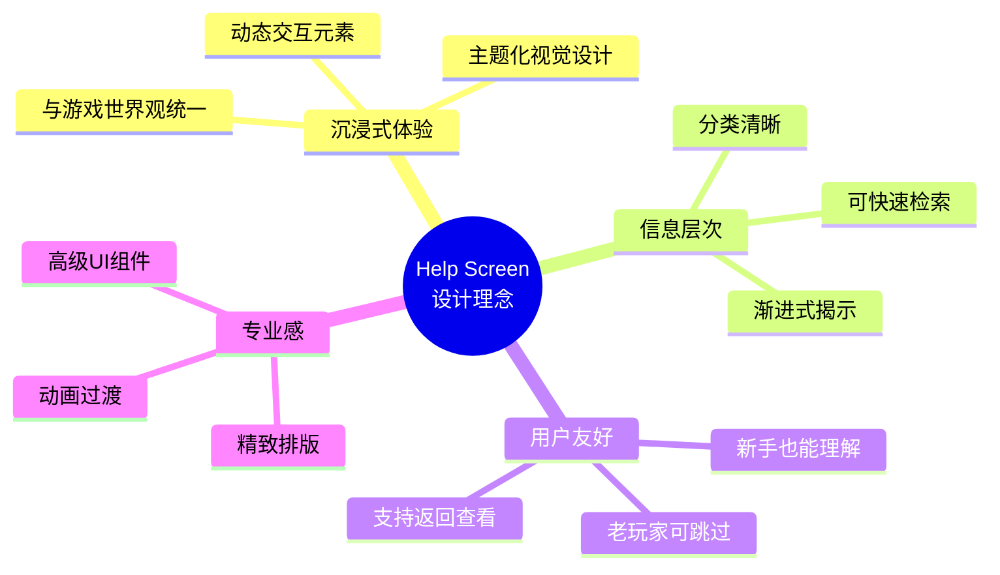
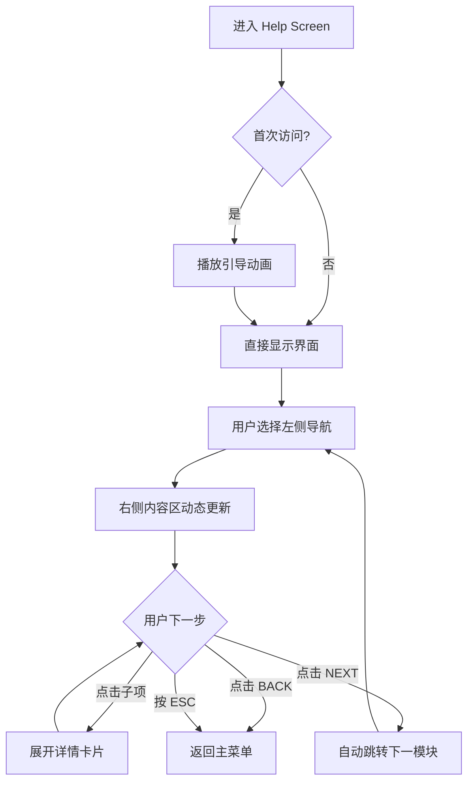

# 📖 Help Screen 设计方案 (游戏帮助界面)

> [!IMPORTANT]
> 本文档详细描述了游戏帮助界面 (Help Screen / Tutorial Screen) 的设计方案。
> 目标：创建一个**专业、高级、沉浸式**的游戏说明书，让玩家在开始游戏前能够全面了解游戏的玩法、操作、系统和技巧。

---

## 1. 设计理念 (Design Philosophy)

### 1.1 核心目标

作为世界顶级游戏设计工程师，我遵循以下设计原则：



### 1.2 设计定位

| 对比维度 | 普通帮助界面 | 本设计方案 |
|---------|-------------|-----------|
| **视觉** | 纯文本列表 | 卡片式交互 + 动态预览 |
| **结构** | 单页长滚动 | **多标签分类** + 侧边导航 |
| **交互** | 静态阅读 | **键位实时演示** + 动画 GIF |
| **体验** | 功能性工具 | **游戏内百科全书** |
| **风格** | 通用UI | **深色科幻主题** (匹配游戏) |

---

## 2. 整体布局 (Interface Layout)

### 2.1 分辨率基准
- 设计分辨率: **1920 x 1080** (16:9)
- 采用 `FitViewport` 保持一致性

### 2.2 页面结构

```
┌─────────────────────────────────────────────────────────────────────────┐
│                          TOP HEADER (120px)                             │
│  [← BACK]              📖 OPERATOR'S MANUAL                  [CLOSE ×]  │
├─────────────────────────────────────────────────────────────────────────┤
│                                                                         │
│  ┌─────────────┐  ┌────────────────────────────────────────────────┐   │
│  │             │  │                                                │   │
│  │   LEFT      │  │              MAIN CONTENT AREA                 │   │
│  │   NAV       │  │                 (1320px)                       │   │
│  │   PANEL     │  │                                                │   │
│  │  (300px)    │  │  ┌─────────────────────────────────────────┐   │   │
│  │             │  │  │         DYNAMIC CONTENT ZONE            │   │   │
│  │  ▼ Controls │  │  │                                         │   │   │
│  │    Movement │  │  │  [根据左侧选择动态展示]                  │   │   │
│  │    Combat   │  │  │                                         │   │   │
│  │  ▼ Systems  │  │  │  • 图文并茂的教程卡片                   │   │   │
│  │    Weapons  │  │  │  • 交互式演示动画                       │   │   │
│  │    Armor    │  │  │  • 数据表格和提示                        │   │   │
│  │    Items    │  │  │                                         │   │   │
│  │  ▼ World    │  │  └─────────────────────────────────────────┘   │   │
│  │    Zones    │  │                                                │   │
│  │    Enemies  │  │                                                │   │
│  │    Hazards  │  │                                                │   │
│  │  ▼ Tips     │  │                                                │   │
│  │             │  │                                                │   │
│  └─────────────┘  └────────────────────────────────────────────────┘   │
│                                                                         │
├─────────────────────────────────────────────────────────────────────────┤
│                        BOTTOM FOOTER (80px)                             │
│       [◄ PREV]    ●●●○○ (Progress Dots)    [NEXT ►]   [SKIP TUTORIAL]   │
└─────────────────────────────────────────────────────────────────────────┘
```

### 2.3 尺寸规划

| 区域 (Zone) | 尺寸 (Size) | 功能描述 |
|-------------|-------------|----------|
| **Top Header** | 1920 x 120px | 标题 + 返回/关闭按钮 |
| **Left Nav Panel** | 300 x 780px | 可折叠的分类导航菜单 |
| **Main Content Area** | 1320 x 780px | 动态内容展示区 |
| **Bottom Footer** | 1920 x 80px | 翻页导航 + 进度指示 |

---

## 3. 内容模块设计 (Content Modules)

帮助界面的内容分为 **5 大模块**，每个模块下有多个子项：

### 3.1 模块一: 基础操作 (Basic Controls) 🎮

#### 3.1.1 移动控制 (Movement)

```
┌──────────────────────────────────────────────────────────────────┐
│  🚶 MOVEMENT CONTROLS                                            │
├──────────────────────────────────────────────────────────────────┤
│                                                                  │
│   ┌─────────────────────────────┐     ┌───────────────────────┐  │
│   │                             │     │   KEY BINDINGS        │  │
│   │      [ W ]                  │     │                       │  │
│   │        ↑                    │     │   W / ↑  Move Up      │  │
│   │   [A] ← → [D]               │     │   A / ←  Move Left    │  │
│   │        ↓                    │     │   S / ↓  Move Down    │  │
│   │      [ S ]                  │     │   D / →  Move Right   │  │
│   │                             │     │                       │  │
│   │  [Animated Character Demo]  │     │   SHIFT  Sprint       │  │
│   │                             │     │   (Hold to run faster)│  │
│   └─────────────────────────────┘     └───────────────────────┘  │
│                                                                  │
│   💡 TIP: 开启冲刺会消耗更多体力，                                │
│      但能更快逃离危险区域。                                       │
│                                                                  │
└──────────────────────────────────────────────────────────────────┘
```

**设计要点**:
- 左侧：**动态角色演示区** - 玩家按键时角色会实时响应移动
- 右侧：**键位绑定面板** - 清晰列出所有移动相关按键
- 底部：**滚动提示条** - 显示实用技巧

#### 3.1.2 战斗操作 (Combat)

```
┌──────────────────────────────────────────────────────────────────┐
│  ⚔️ COMBAT CONTROLS                                              │
├──────────────────────────────────────────────────────────────────┤
│                                                                  │
│   ┌───────────────────────────────────────────────────────────┐  │
│   │  [SPACE BAR]                                              │  │
│   │  ═══════════════════════════════════════════════════════  │  │
│   │  PRIMARY ATTACK                                           │  │
│   │  Use your equipped weapon to attack enemies in range.     │  │
│   └───────────────────────────────────────────────────────────┘  │
│                                                                  │
│   ┌──────────────────────┐  ┌──────────────────────┐             │
│   │ [1] [2] [3] [4] [5]  │  │  ATTACK RANGE        │             │
│   │  Weapon Quick Slots  │  │  ════════════        │             │
│   │                      │  │  MELEE: 2.2 units    │             │
│   │  Switch between      │  │  RANGED: 5-6 units   │             │
│   │  equipped weapons    │  │  [视觉范围演示]       │             │
│   └──────────────────────┘  └──────────────────────┘             │
│                                                                  │
│   ⚠️ WARNING: 攻击有冷却时间 (Cooldown)，                         │
│      请注意武器的冷却条！                                          │
│                                                                  │
└──────────────────────────────────────────────────────────────────┘
```

#### 3.1.3 其他操作 (Other Actions)

| 按键 | 动作 | 描述 |
|-----|------|------|
| **ESC** | 暂停菜单 (Pause) | 暂停游戏，打开菜单 |
| **E** | 拾取 (Interact) | 拾取地上的物品 (可选功能) |
| **M** | 地图 (Map) | 查看当前迷宫概览 (如有) |
| **TAB** | 背包 (Inventory) | 查看已收集物品 |
| **`** (反引号) | 开发者控制台 | 仅限 Cheat Mode 启用时 |

---

### 3.2 模块二: 武器系统 (Weapon System) ⚔️

#### 3.2.1 武器总览表

```
┌──────────────────────────────────────────────────────────────────────────┐
│  ⚔️ WEAPON ARSENAL                                                       │
├──────────────────────────────────────────────────────────────────────────┤
│                                                                          │
│  ┌──────────┐  ┌──────────┐  ┌──────────┐  ┌──────────┐  ┌──────────┐   │
│  │ ⚔️ SWORD │  │ ❄️ ICE   │  │ 🔥 FIRE  │  │ 🎯 CROSS │  │ ✨ MAGIC │   │
│  │          │  │    BOW   │  │   STAFF  │  │    BOW   │  │    WAND  │   │
│  │  [Icon]  │  │  [Icon]  │  │  [Icon]  │  │  [Icon]  │  │  [Icon]  │   │
│  │          │  │          │  │          │  │          │  │          │   │
│  │  MELEE   │  │  RANGED  │  │  RANGED  │  │  RANGED  │  │  RANGED  │   │
│  └──────────┘  └──────────┘  └──────────┘  └──────────┘  └──────────┘   │
│                                                                          │
│                    [ 点击任一武器查看详情 ]                               │
│                                                                          │
└──────────────────────────────────────────────────────────────────────────┘
```

#### 3.2.2 武器详情卡片 (展开状态)

```
┌──────────────────────────────────────────────────────────────────────────┐
│  ⚔️ IRON SWORD                                              ⚪ COMMON   │
├──────────────────────────────────────────────────────────────────────────┤
│                                                                          │
│  ┌───────────────────────┐    ┌─────────────────────────────────────┐   │
│  │                       │    │  STATS                              │   │
│  │    [ 大型武器图标 ]    │    │  ─────────────────────────────────  │   │
│  │      (animated)       │    │  Damage:     ████████░░  1 pts      │   │
│  │                       │    │  Range:      ████░░░░░░  2.2 units  │   │
│  │                       │    │  Cooldown:   ██░░░░░░░░  0.3s       │   │
│  │                       │    │  Type:       PHYSICAL               │   │
│  │                       │    │  Effect:     None                   │   │
│  └───────────────────────┘    └─────────────────────────────────────┘   │
│                                                                          │
│  DESCRIPTION                                                             │
│  ───────────────────────────────────────────────────────────────────    │
│  A reliable close-range weapon. Perfect for beginners.                   │
│  Best used against lightly armored enemies.                              │
│                                                                          │
│  💡 STRATEGY TIP: 近距离武器适合在走廊等狭窄空间使用，                    │
│     避免被多个敌人同时包围。                                             │
│                                                                          │
└──────────────────────────────────────────────────────────────────────────┘
```

#### 3.2.3 五种武器数据一览

| 武器 | 类型 | 伤害类型 | 伤害 | 射程 | 冷却 | 特效 |
|-----|------|---------|------|------|-----|------|
| **⚔️ Iron Sword** | 近战 | PHYSICAL | 1 | 2.2 | 0.3s | 无 |
| **❄️ Ice Bow** | 远程 | PHYSICAL | 1 | 5.0 | 0.8s | ❄️ 冰冻敌人 (Freeze) |
| **🔥 Fire Staff** | 远程 | MAGICAL | 2 | 3.0 | 1.2s | 🔥 持续燃烧 (Burn DoT) |
| **🎯 Crossbow** | 远程 | PHYSICAL | 2 | 6.0 | 1.5s | 无 (高穿透) |
| **✨ Magic Wand** | 远程 | MAGICAL | 1 | 5.0 | 1.0s | 🔥 燃烧 (Burn) |

---

### 3.3 模块三: 护甲系统 (Armor System) 🛡️

#### 3.3.1 护甲机制说明

```
┌──────────────────────────────────────────────────────────────────────────┐
│  🛡️ ARMOR PROTECTION SYSTEM                                             │
├──────────────────────────────────────────────────────────────────────────┤
│                                                                          │
│  ┌─────────────────────────────────────────┐                             │
│  │                                         │                             │
│  │           DAMAGE FLOW DIAGRAM           │                             │
│  │                                         │                             │
│  │    [ 🔥 Enemy Attack ]                  │                             │
│  │            │                            │                             │
│  │            ▼                            │                             │
│  │    ┌───────────────┐                    │                             │
│  │    │ Damage Type?  │                    │                             │
│  │    └───────┬───────┘                    │                             │
│  │            │                            │                             │
│  │   ┌────────┴────────┐                   │                             │
│  │   │                 │                   │                             │
│  │   ▼                 ▼                   │                             │
│  │ PHYSICAL         MAGICAL                │                             │
│  │   │                 │                   │                             │
│  │   ▼                 ▼                   │                             │
│  │ 🛡️ Physical      🔮 Magical            │                             │
│  │   Armor?          Armor?               │                             │
│  │   │                 │                   │                             │
│  │   ▼                 ▼                   │                             │
│  │ [吸收伤害]       [吸收伤害]             │                             │
│  │                                         │                             │
│  └─────────────────────────────────────────┘                             │
│                                                                          │
│  ⚠️ IMPORTANT: 护甲只能吸收对应类型的伤害！                               │
│     穿着物理护甲无法抵御魔法攻击！                                        │
│                                                                          │
└──────────────────────────────────────────────────────────────────────────┘
```

#### 3.3.2 四种护甲一览

| 护甲 | 抵抗类型 | 护盾值 | 价格 | 推荐场景 |
|-----|---------|-------|-----|---------|
| **🛡️ Iron Shield** | PHYSICAL | 5 | 80g | 对抗史莱姆、蝎子等物理敌人 |
| **🔮 Arcane Robe** | MAGICAL | 4 | 80g | 对抗法师类敌人 |
| **⚔️ Knight's Plate** | PHYSICAL | 8 | 150g | 高防御，适合冲锋流 |
| **🧙 Wizard's Cloak** | MAGICAL | 7 | 150g | 高法防，后期太空站必备 |

---

### 3.4 模块四: 游戏世界 (Game World) 🌍

#### 3.4.1 五大区域介绍

采用**卡片轮播** (Carousel) 设计，玩家可以左右滑动查看每个区域：

```
┌──────────────────────────────────────────────────────────────────────────┐
│  🌍 EXPLORE THE WORLD                                                    │
├──────────────────────────────────────────────────────────────────────────┤
│                                                                          │
│  ◄  ┌────────────────────────────────────────────────────────────┐  ►   │
│     │                                                            │       │
│     │   🌿 ZONE 1: THE PRIMITIVE FOREST                         │       │
│     │   ════════════════════════════════════════════════════    │       │
│     │                                                            │       │
│     │   ┌─────────────────────┐    LEVELS: 1 - 4                │       │
│     │   │                     │    DIFFICULTY: ★☆☆☆☆            │       │
│     │   │   [ 区域概念图 ]     │                                  │       │
│     │   │   (森林/废墟场景)    │    THEME: Grassland / Forest    │       │
│     │   │                     │    COLOR: 🟢 Green              │       │
│     │   └─────────────────────┘                                  │       │
│     │                                                            │       │
│     │   LORE:                                                    │       │
│     │   "The journey begins in the overgrown ruins of the       │       │
│     │    old world. Nature has reclaimed these halls."          │       │
│     │                                                            │       │
│     │   FEATURES:                                                │       │
│     │   • Basic navigation and movement                         │       │
│     │   • Key hunting: Find keys to unlock exits                │       │
│     │   • Slow-moving Slimes                                    │       │
│     │   • No complex hazards                                    │       │
│     │                                                            │       │
│     └────────────────────────────────────────────────────────────┘       │
│                                                                          │
│                        ( ● ○ ○ ○ ○ )                                     │
│                        Zone Navigator                                    │
│                                                                          │
└──────────────────────────────────────────────────────────────────────────┘
```

**五大区域数据**:

| Zone | 名称 | 关卡 | 主色调 | 特色机制 |
|------|------|------|--------|---------|
| 1 | 🌿 The Primitive Forest | 1-4 | 绿色 | 基础玩法教学 |
| 2 | 🏜️ The Scorched Sands | 5-8 | 黄/橙色 | 流沙减速 + 周期性地刺 |
| 3 | ❄️ The Frozen Tundra | 9-12 | 青/白色 | 冰面滑行 + 暴风雪迷雾 |
| 4 | 🌴 The Toxic Jungle | 13-16 | 紫/深绿 | 毒气区域 + 传送门 |
| 5 | 🚀 The Orbital Station | 17-20 | 深蓝/霓虹 | 激光门 + 电击地板 |

#### 3.4.2 敌人图鉴 (Enemy Bestiary)

```
┌──────────────────────────────────────────────────────────────────────────┐
│  👾 ENEMY BESTIARY                                                       │
├──────────────────────────────────────────────────────────────────────────┤
│                                                                          │
│  ┌────────────────────────────────────────────────────────────────────┐  │
│  │  🐸 SLIME                                               Zone 1    │  │
│  ├────────────────────────────────────────────────────────────────────┤  │
│  │                                                                    │  │
│  │   ┌─────────┐    HP: ██░░░░░░░░  Low                              │  │
│  │   │ [动画]  │    Speed: █░░░░░░░░░  Slow                          │  │
│  │   │  史莱姆 │    Damage Type: PHYSICAL                            │  │
│  │   └─────────┘                                                      │  │
│  │                                                                    │  │
│  │   BEHAVIOR: Slow patrol, basic chase on sight                     │  │
│  │   WEAKNESS: All weapon types                                       │  │
│  │   TIP: 新手练习的最佳对象                                          │  │
│  │                                                                    │  │
│  └────────────────────────────────────────────────────────────────────┘  │
│                                                                          │
│  ┌────────────────────────────────────────────────────────────────────┐  │
│  │  🦇 BAT                                                 Zone 1-2  │  │
│  │  ...                                                               │  │
│  └────────────────────────────────────────────────────────────────────┘  │
│                                                                          │
└──────────────────────────────────────────────────────────────────────────┘
```

#### 3.4.3 陷阱与危险 (Hazards)

| 陷阱类型 | 出现区域 | 伤害 | 特性 | 应对策略 |
|---------|---------|------|------|---------|
| **🔺 Spike Trap** | Zone 2+ | 1 HP | 周期性激活 | 观察节奏，择机通过 |
| **🌊 Quicksand** | Zone 2 | - | 减速 50% | 尽快离开 |
| **❄️ Ice Floor** | Zone 3 | - | 滑行直到撞墙 | 提前规划路线 |
| **☁️ Blizzard** | Zone 3 | - | 视野受限 | 开启导航箭头 |
| **☠️ Poison Gas** | Zone 4 | 持续 | 区域内持续掉血 | 快速穿过或绕行 |
| **🌀 Teleporter** | Zone 4 | - | 传送至地图另一端 | 记住传送位置 |
| **⚡ Electric Floor** | Zone 5 | 2 HP | 周期性放电 | 计时通过安全期 |
| **🔴 Laser Gate** | Zone 5 | Instant | 需开关解除 | 找到控制面板 |

---

### 3.5 模块五: 进阶技巧 (Pro Tips) 💡

#### 3.5.1 通用策略

```
┌──────────────────────────────────────────────────────────────────────────┐
│  💡 PRO TIPS & STRATEGIES                                                │
├──────────────────────────────────────────────────────────────────────────┤
│                                                                          │
│  🎖️ GENERAL TACTICS                                                     │
│  ═══════════════════════════════════════════════════════════════════    │
│                                                                          │
│  1️⃣  NEVER GET SURROUNDED                                               │
│      • 利用走廊地形，让敌人排成一列                                      │
│      • 背靠墙壁战斗，减少受攻击方向                                      │
│                                                                          │
│  2️⃣  MATCH YOUR GEAR TO THE ZONE                                        │
│      • Zone 1-2: 物理护甲 + 任意武器                                     │
│      • Zone 3: 冰弓 (控制) + 物理护甲                                    │
│      • Zone 4-5: 法术护甲 + 远程武器                                     │
│                                                                          │
│  3️⃣  USE THE NAVIGATION ARROW                                           │
│      • 启用 Cheat Mode 可看到钥匙导航                                     │
│      • 普通模式下箭头指向出口                                            │
│                                                                          │
│  4️⃣  CONSERVE HEALTH                                                    │
│      • 每局只有 3 条命，谨慎行动                                         │
│      • 找到治疗药水时要考虑是否立即使用                                  │
│                                                                          │
│  5️⃣  SHOP WISELY                                                        │
│      • 了解下一区域的敌人类型再购买装备                                  │
│      • 优先升级护甲而非武器                                              │
│                                                                          │
└──────────────────────────────────────────────────────────────────────────┘
```

#### 3.5.2 速通技巧 (Speedrun Tips)

- **冲刺直线 (Sprint Dash)**: 熟记地图后，按住 SHIFT 直冲钥匙和出口
- **敌人吸引 (Enemy Kiting)**: 大多数敌人可以被引开再绕回目标位置
- **武器快切 (Quick Swap)**: 数字键切武器没有冷却惩罚

#### 3.5.3 隐藏彩蛋提示

> [!TIP]
> 游戏中存在隐藏成就！尝试在凌晨 2:00-4:00 游玩，或在游戏发布日登录，会有惊喜...

---

## 4. 视觉风格 (Visual Style)

### 4.1 配色方案

| 元素 | 颜色 | HEX | 说明 |
|------|------|-----|------|
| **背景** | 深空黑 | `#0A0A14` | 与游戏主题一致 |
| **主面板** | 半透明深灰 | `rgba(20,20,30,0.85)` | 磨砂玻璃效果 |
| **边框线** | 科技蓝 | `#00D4FF` | 发光边框 |
| **标题文字** | 纯白 | `#FFFFFF` | 带轻微发光 |
| **正文文字** | 浅灰 | `#B8B8CC` | 易读性高 |
| **强调色** | 金色 / 青色 | `#FFD700` / `#00FFFF` | 关键词高亮 |
| **警告色** | 橙红色 | `#FF6B35` | 危险提示 |

### 4.2 字体建议

- **标题**: `Orbitron` (科幻风格) 或 `Rajdhani` (现代感)
- **正文**: `Roboto` / `Noto Sans` (清晰易读)
- **代码/按键**: `JetBrains Mono` (等宽字体)

### 4.3 动效设计

| 动效类型 | 应用场景 | 时长 | 缓动函数 |
|---------|---------|------|---------|
| **淡入淡出** | 页面切换 | 300ms | ease-in-out |
| **滑入** | 内容面板展开 | 400ms | ease-out |
| **脉冲发光** | 选中项高亮 | 1200ms (循环) | sine |
| **悬停放大** | 可点击元素 | 150ms | ease-out |
| **键位提示** | 按键动画闪烁 | 800ms | ease-in-out |

---

## 5. 交互逻辑 (Interaction Logic)

### 5.1 导航交互



### 5.2 状态管理

- **访问记录**: 使用 `Preferences` 记录用户是否已阅读某模块
- **进度指示**: 底部进度点会高亮已读模块
- **书签功能** (可选): 允许用户标记常用帮助页面

### 5.3 键盘快捷键

| 快捷键 | 动作 |
|-------|------|
| `←` / `→` | 切换标签页 / 翻页 |
| `↑` / `↓` | 左侧导航列表滚动 |
| `Enter` | 展开选中项 |
| `ESC` | 返回上一级 / 关闭 |
| `S` | 跳过教程 (首次访问时) |

---

## 6. 入口与触发 (Entry Points)

### 6.1 从主菜单进入

在 `MenuScreen` 中新增 **"Help"** 按钮，位置建议放在 `Settings` 按钮附近：

```
┌─────────────────────────┐
│   🎮 MAZE RUNNER        │
├─────────────────────────┤
│   [  New Game  ]        │
│   [ Select Level ]      │
│   [ Random Map ]        │
│   [ Load Game ]         │
│   [ Leaderboard ]       │  <-- 现有
│   [ Achievements ]      │
│   [📖 Help ]            │  <-- 新增
│   [ Settings ]          │
│   [ Exit ]              │
└─────────────────────────┘
```

### 6.2 从暂停菜单进入

在游戏内按 `ESC` 暂停时，提供快捷链接到帮助界面。

### 6.3 首次游戏提示 (可选)

检测到新玩家 (无存档) 时，弹出提示：

```
┌──────────────────────────────────────┐
│  🎮 Welcome, Operator!               │
│                                      │
│  Would you like to view the          │
│  Operator's Manual before starting?  │
│                                      │
│  [ Yes, teach me! ]  [ No, I'm Pro ] │
└──────────────────────────────────────┘
```

---

## 7. 技术实现要点 (Technical Highlights)

### 7.1 继承与复用

- **必须继承 `BaseScreen`**: 保持与其他界面的一致性
- **使用 `UIUtils`**: 复用滚动焦点、按钮创建等工具方法
- **使用 `UIConstants`**: 统一按钮尺寸和间距

### 7.2 数据驱动

建议使用 **JSON 配置文件** 存储帮助内容，便于后续更新和本地化：

```json
{
  "modules": [
    {
      "id": "controls",
      "title": "Basic Controls",
      "icon": "icon_gamepad",
      "sections": [
        {
          "id": "movement",
          "title": "Movement",
          "content": "..."
        }
      ]
    }
  ]
}
```

### 7.3 资源管理

| 资源类型 | 说明 | 加载时机 |
|---------|------|---------|
| **Icons** | 武器/护甲/敌人图标 | 使用现有 `TextureManager` |
| **Demo Animation** | 角色演示动画帧 | 复用 `character.png` |
| **Zone Art** | 区域概念图 | 懒加载，按需显示 |
| **Font** | 特殊字体 | `FreeTypeFontGenerator` |

---

## 8. 总结与优先级 (Summary & Priority)

### 8.1 实现优先级

| 优先级 | 内容模块 | 理由 |
|-------|---------|------|
| 🔴 **P0** | 基础操作 (Controls) | 新手必看，核心功能 |
| 🔴 **P0** | 左侧导航 + 框架 | 整体结构基础 |
| 🟠 **P1** | 武器系统 | 战斗核心，玩家常问 |
| 🟠 **P1** | 护甲系统 | 策略深度，需解释 |
| 🟡 **P2** | 游戏世界 (区域 + 敌人) | 内容丰富，增强沉浸 |
| 🟢 **P3** | 进阶技巧 | 锦上添花，老玩家福利 |

### 8.2 设计亮点总结

| 亮点 | 描述 |
|------|------|
| **沉浸式 UI** | 深色科幻主题，与游戏世界观统一 |
| **卡片交互** | 点击展开详情，避免信息过载 |
| **动态演示** | 键位实时响应，角色小动画 |
| **轮播区域** | 五大区域卡片轮播，视觉吸引力强 |
| **数据表格** | 武器/护甲/敌人数据一目了然 |
| **进度追踪** | 记住已读模块，支持书签 |

---

> [!NOTE]
> 本设计方案为**纯设计阶段**产出，后续可根据实际开发需求调整具体实现细节。
> 下一步：获得用户确认后，创建 `implementation_plan.md` 开始编码实现。

---

*Created by AI Game Design Assistant*
*Design Standard: AAA Game UI/UX Guidelines*
