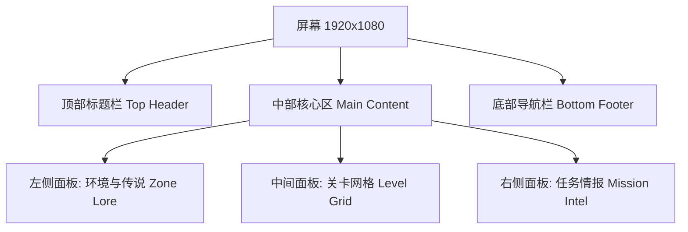

# Level Select Screen Design (关卡选择界面设计方案)

> [!IMPORTANT]
> 本文档详细描述了新的关卡选择界面设计。该设计旨在提供专业、美观、对称的视觉体验，并清晰地展示每个关卡的主题和玩法特征。

## 1. 核心设计理念 (Core Design Philosophy)

*   **Symmetry (对称性)**: 界面采用经典的 "三段式" 布局 (左-中-右)，确保视觉重心的平衡。
*   **Immersion (沉浸感)**: 不同的关卡组 (Zone) 会触发周边面板的动态变化（背景图、文字描述、配色），让玩家在选择关卡时就能感受到该区域的氛围。
*   **Information (信息深度)**: 不仅仅是按钮，而是提供充足的 "情报" (Intel)，让玩家知道即将面对什么。

## 2. 界面布局 (Interface Layout)

分辨率基准: 1920 x 1080 (16:9)

### 详细尺寸规划 (Dimensions)

| 区域 (Zone) | 位置 (Position) | 尺寸 (Size) | 内容说明 (Content) |
| :--- | :--- | :--- | :--- |
| **Top Header** | 顶部 (Top) | 1920 x 120px | 居中显示大标题 "OPERATION: MAZE RUNNER" 或 "LEVEL SELECT"，两侧装饰线条。 |
| **Left Panel** | 左侧 (Left) | 450 x 800px | **主题展示区**。显示当前选中关卡所属区域的名称、概念图、以及背景传说。 |
| **Center Panel** | 中间 (Center) | 1020 x 800px | **核心选择区**。放置 4列 x 5行 的关卡节点 (Level Nodes)。 |
| **Right Panel** | 右侧 (Right) | 450 x 800px | **情报分析区**。显示当前选中关卡的玩法特征、敌人类型、陷阱列表、最高分记录。 |
| **Bottom Footer** | 底部 (Bottom) | 1920 x 160px | 功能按钮区。左侧 "BACK" (返回)，右侧 "INITIATE" (开始游戏)。 |

---

## 3. 关卡与主题规划 (Level & Theme Breakdown)

我们将 20 个关卡划分为 5 个独特的区域 (Zones)，每个区域包含 4 个关卡。

### Zone 1: The Primitive Forest (原始森林)
*   **Levels**: 1 - 4
*   **Theme**: Grassland / Forest (绿色主色调)
*   **Lore**: "The journey begins in the overgrown ruins of the old world. Nature has reclaimed these halls." (旅程始于旧世界的废墟，大自然已重新接管了一切。)
*   **Gameplay Features (玩法特征)**:
    *   **Basic Navigation**: 学习移动和转向。
    *   **Key Hunt**: 寻找隐藏的钥匙以开启大门。
    *   **Enemies**: Slimes (史莱姆) - 移动缓慢，易于躲避。
    *   **Hazards**: 无复杂陷阱。

### Zone 2: The Scorched Sands (焦热沙原)
*   **Levels**: 5 - 8
*   **Theme**: Desert (黄色/橙色主色调)
*   **Lore**: "An immense desert where the sun never sets. Only the swift survive the shifting sands." (永不日落的巨大沙漠，唯有敏捷者方能生存。)
*   **Gameplay Features (玩法特征)**:
    *   **Terrain**: Quicksand (流沙) - 降低移动速度。
    *   **Traps**: Spike Traps (地刺) - 周期性刺出地面。
    *   **Enemies**: Scorpions (蝎子) - 速度较快，巡逻范围大。
    *   **Challenge**: 迷宫路径变得更加曲折。

### Zone 3: The Frozen Tundra (极寒冻土)
*   **Levels**: 9 - 12
*   **Theme**: Ice / Snow (青色/白色主色调)
*   **Lore**: "Bitter cold freezes the very air. Watch your step, for the ground offers no grip." (严寒冻结了空气。小心脚下，地面毫无摩擦力。)
*   **Gameplay Features (玩法特征)**:
    *   **Terrain**: Ice Floor (冰面) - 玩家移动时会打滑，直到撞墙才停止。
    *   **Visibility**: Snowstorm (暴风雪) - 视野受限 (Fog of War 强化)。
    *   **Traps**: Icicles (冰锥) - 从天而降或固定障碍。
    *   **Enemies**: Yetis (雪人) - 拥有击退效果。

### Zone 4: The Toxic Jungle (剧毒沼泽)
*   **Levels**: 13 - 16
*   **Theme**: Jungle / Swamp (深紫色/深绿色主色调)
*   **Lore**: "A bio-hazardous zone filled with mutated flora. The air itself is the enemy." (充满变异植物的生化危险区。空气本身就是敌人。)
*   **Gameplay Features (玩法特征)**:
    *   **Hazards**: Poison Gas (毒气) - 持续扣血区域，需快速通过。
    *   **Mechanics**: Teleporters (传送门) - 瞬间移动到地图另一端。
    *   **Enemies**: Mutated Spiders (变异蜘蛛) - 速度极快，会主动追击。
    *   **Complexity**: 多层迷宫结构。

### Zone 5: The Orbital Station (轨道空间站)
*   **Levels**: 17 - 20
*   **Theme**: Space / Scifi (深蓝色/霓虹色主色调)
*   **Lore**: "The final frontier. Gravity is optional, but survival is mandatory." (最后的边疆。重力是可选的，但生存是必须的。)
*   **Gameplay Features (玩法特征)**:
    *   **Mechanics**: Laser Gates (激光门) - 需要开关才能关闭。
    *   **Hazards**: Electric Floors (带电地板) - 周期性放电。
    *   **Enemies**: Security Drones (无人机) - 远程攻击或极高移速。
    *   **Ultimate Challenge**: 综合运用所有机制。

---

## 4. 视觉风格与交互 (Visual Style & Interaction)

### UI 配色方案 (Color Palette)
*   **Background**: 深色磨砂玻璃效果，稍微透出主菜单背景，但叠加了黑色遮罩 (Opacity 80%)。
*   **Panel Borders**:
    *   **Default**: 银灰色 (Metallic Silver)
    *   **Selected (Level)**: 根据主题变化 (如 Zone 2 选中时，边框发金色光)。
*   **Text**:
    *   **Headers**: 纯白色，带有轻微发光效果。
    *   **Body Text**: 浅灰色 (Light Grey)，易读性高。
    *   **Highlights**: 金色 (Gold) 或 青色 (Cyan) 用于强调关键信息。

### 交互逻辑 (Interaction Logic)

1.  **Hover Effect (悬停)**:
    *   当鼠标悬停在某个 **Level Button** 上时：
        *   **Left Panel** 更新显示该关卡所属 Zone 的信息 (图片 + Lore)。
        *   **Right Panel** 更新显示该关卡具体的 "Mission Intel" (敌人列表 + 陷阱)。
        *   Level Button 本身放大 1.1倍，边框高亮。
2.  **Lock State (锁定状态)**:
    *   未解锁的关卡显示为灰色图标，且带有一把 "锁" 的 Icon。
    *   悬停在锁定关卡上时，Right Panel 显示 "ACCESS DENIED - Complete previous level to unlock"。
3.  **Selection (选中/点击)**:
    *   点击关卡后，该关卡进入 "Ready to Launch" 状态（可能会有个脉冲动画）。
    *   底部的 **INITIATE** 按钮从灰色变为亮绿色 (或主题色)，并激活可点击。
    *   双击关卡可以直接开始游戏。

## 5. 组件细节 (Component Details)

### 中间网格 (Level Node)
*   形状: 正方形 或 菱形 / 六边形 增强科幻感。我们采用 **圆角正方形** 以保持整洁。
*   内容:
    *   中央显示数字 (1-20)。
    *   右下角显示小星星 (0-3)，代表该关卡的通关评价 (Star Rating)。
    *   背景图为该主题的微缩纹理。

### 左右面板 (Info Panels)
*   **Header**: 使用特殊的装饰性字体 (如 "Orbitron" 或 像素字体)。
*   **Content**: 使用列表项 (Bullet points) 使得信息一目了然。
    *   Example:
        *   [icon] **Traps**: Spikes, Lava
        *   [icon] **Enemies**: 2x Scorpions

---

## 总结 (Summary)
此设计方案通过左右对称的信息面板，解决了原版 "只有按钮" 的枯燥感。通过将关卡划分为 5 个主题区域，并为每个区域赋予独特的视觉风格和玩法描述，极大地增强了游戏的探索感和专业度。
