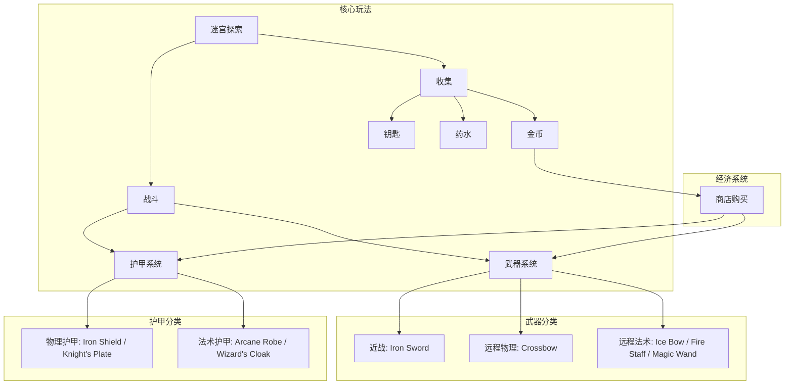
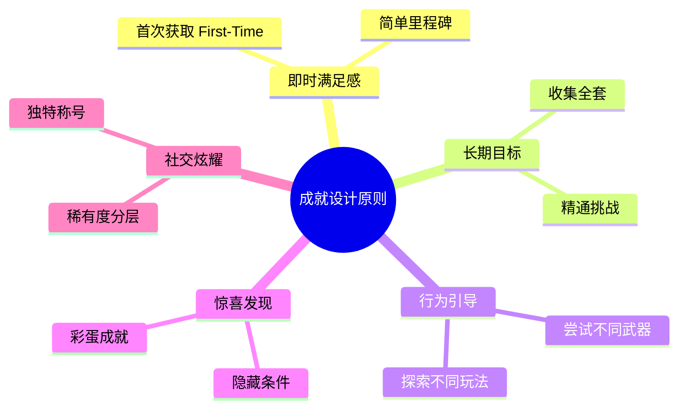
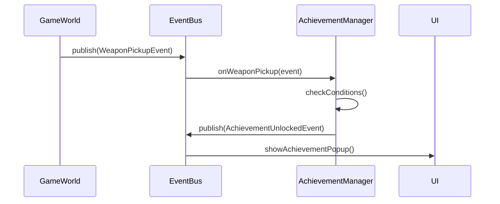

# 🏆 A-Maze-ing 迷宫游戏 成就系统深度设计分析

> **作者视角**：世界顶级游戏策划 (Senior Game Designer)  
> **分析目标**：设计一个既能增强核心循环 (Core Loop)、又能提供长期游玩动力的成就系统

---

## 📋 目录

1. [游戏核心机制分析](#1-游戏核心机制分析)
2. [成就系统设计哲学](#2-成就系统设计哲学)
3. [武器成就体系设计](#3-武器成就体系设计)
4. [护甲成就体系设计](#4-护甲成就体系设计)
5. [综合成就体系设计](#5-综合成就体系设计)
6. [成就难度梯度设计](#6-成就难度梯度设计)
7. [成就奖励与激励机制](#7-成就奖励与激励机制)
8. [UI/UX 成就展示设计](#8-uiux-成就展示设计)
9. [技术实现建议](#9-技术实现建议)

---

## 1. 游戏核心机制分析

### 1.1 现有游戏系统总览



### 1.2 武器系统深度分析

| 武器名称 | 类型 | 伤害类型 | 伤害 | 射程 | 冷却 | 特效 | 稀有度建议 |
|---------|------|----------|------|------|------|------|------------|
| **Iron Sword** | 近战 | PHYSICAL | 1 | 2.2 | 0.3s | 无 | ⚪ 普通 |
| **Ice Bow** | 远程 | PHYSICAL | 1 | 5.0 | 0.8s | ❄️ 冰冻 | 🔵 稀有 |
| **Fire Staff** | 远程 | MAGICAL | 2 | 3.0 | 1.2s | 🔥 燃烧 | 🟣 史诗 |
| **Crossbow** | 远程 | PHYSICAL | 2 | 6.0 | 1.5s(2.0s装填) | 无 | 🔵 稀有 |
| **Magic Wand** | 远程 | MAGICAL | 1 | 5.0 | 1.0s(1.5s装填) | 🔥 燃烧 | 🟣 史诗 |

> [!IMPORTANT]
> **设计洞察**：武器的 **伤害类型** (PHYSICAL vs MAGICAL) 与敌人/玩家的护甲类型形成策略博弈。这是成就设计的核心切入点。

### 1.3 护甲系统深度分析

| 护甲名称 | 抵抗类型 | 护盾值 | 价格 | 策略定位 |
|---------|---------|--------|------|----------|
| **Iron Shield** | PHYSICAL | 5 | 80 | 抵御近战敌人 |
| **Arcane Robe** | MAGICAL | 4 | 80 | 抵御法师敌人 |
| **Knight's Plate** | PHYSICAL | 8 | 150 | 重甲坦克流 |
| **Wizard's Cloak** | MAGICAL | 7 | 150 | 法术防御专家 |

### 1.4 游戏主题与关卡进度

游戏包含 **5大主题区域**，每区域4关，共20关：

| 区域 | 关卡 | 主题 | 预期敌人特性 |
|------|------|------|-------------|
| 1 | 1-4 | 🌿 **Grassland** (草原) | 物理攻击为主 |
| 2 | 5-8 | 🏜️ **Desert** (沙漠) | 混合攻击 |
| 3 | 9-12 | ❄️ **Ice** (冰原) | 减速/冰冻 |
| 4 | 13-16 | 🌴 **Jungle** (丛林) | 范围伤害 |
| 5 | 17-20 | 🚀 **Spaceship** (太空站) | 高法术伤害 |

---

## 2. 成就系统设计哲学

### 2.1 核心设计原则

作为世界顶级游戏策划，我遵循以下设计原则：



### 2.2 成就类型金字塔

按照获取难度与稀有度设计分层：

```
                    ▲
                   /▲\
                  / ▲ \        🏆 传说 (Legendary) - 0.5%
                 /  ▲  \       极限挑战、完美主义者
                /   ▲   \
               /────────\
              /    🟣    \     🟣 史诗 (Epic) - 5%
             /  ────────  \    收集全套、进阶技巧
            /      🔵      \
           /   ──────────   \  🔵 稀有 (Rare) - 15%
          /        ⚪        \ 特定里程碑、首次使用
         / ──────────────────  \
        /         ⚪           \ ⚪ 普通 (Common) - 30%
       /───────────────────────\ 基础流程、新手教学
```

### 2.3 玩家心理学应用

| 心理机制 | 应用策略 | 成就示例 |
|---------|---------|---------|
| **即时反馈** (Instant Gratification) | 首次触发即解锁 | "Sword Collector" - 首次捡起剑 |
| **目标梯度效应** (Goal Gradient) | 越接近目标越努力 | 显示收集进度 4/5 |
| **损失厌恶** (Loss Aversion) | 错过才觉可惜 | 限时/隐藏成就预告 |
| **内在动机** (Intrinsic Motivation) | 挑战自我而非仅奖励 | "无伤通关" 不给额外奖励但有荣誉 |
| **收集癖** (Completionism) | 提供完整收集目标 | "Arsenal Complete" |

---

## 3. 武器成就体系设计

### 3.1 武器首次获取成就

#### 设计理念
- **目的**：鼓励玩家尝试所有武器，而非只用"最强"武器
- **触发**：首次 **拾取** (pickup) 该武器时立即解锁
- **难度**：普通 (Common)

| 成就名称 | 图标提议 | 触发条件 | 稀有度 |
|---------|---------|---------|--------|
| **⚔️ Sword Collector** | 铁剑图标 | 首次拾取 Iron Sword | ⚪ 普通 |
| **🏹 Bow Hunter** | 冰弓图标 | 首次拾取 Ice Bow | ⚪ 普通 |
| **🔥 Staff Wielder** | 火杖图标 | 首次拾取 Fire Staff | ⚪ 普通 |
| **🎯 Crossbow Expert** | 弩图标 | 首次拾取 Crossbow | ⚪ 普通 |
| **✨ Wand Master** | 魔杖图标 | 首次拾取 Magic Wand | ⚪ 普通 |

#### 现有代码对照

现有 `AchievementManager.checkWeaponPickup()` 已实现基础逻辑，但可扩展：

```java
// 现有实现（需扩展）
switch (weaponName) {
    case "Steel Sword": case "Sword":
        achievementName = "Sword Collector";
        break;
    // ... 其他武器
}
```

### 3.2 武器精通成就

#### 设计理念
- **目的**：引导玩家 **深度使用** 武器，而非浅尝辄止
- **触发**：使用特定武器达成击杀数里程碑
- **难度**：稀有 → 史诗

| 成就名称 | 触发条件 | 稀有度 | 设计意图 |
|---------|---------|--------|---------|
| **⚔️ Blade Dancer** | 用 Sword 击杀 25 敌人 | 🔵 稀有 | 近战精通 |
| **⚔️ Sword Saint** | 用 Sword 击杀 100 敌人 | 🟣 史诗 | 近战大师 |
| **❄️ Frozen Heart** | 用 Ice Bow 造成 50 次冰冻效果 | 🔵 稀有 | 控制流专家 |
| **❄️ Winter's Wrath** | 用 Ice Bow 击杀 100 被冰冻敌人 | 🟣 史诗 | 冰系大师 |
| **🔥 Pyromaniac** | 用 Fire Staff 造成 50 次燃烧效果 | 🔵 稀有 | DOT伤害专家 |
| **🔥 Inferno Master** | 用任意火焰武器共击杀 150 敌人 | 🟣 史诗 | 火系大师 |
| **🎯 Sharpshooter** | 用 Crossbow 击杀 50 敌人 | 🔵 稀有 | 远程物理专家 |
| **🎯 Sniper Elite** | 用 Crossbow 单次击杀 5 敌人(不错过) | 🟣 史诗 | 精准射手 |
| **✨ Arcane Apprentice** | 用 Magic Wand 击杀 50 敌人 | 🔵 稀有 | 法术入门 |
| **✨ Archmage** | 用法术武器共击杀 200 敌人 | 🟣 史诗 | 法术宗师 |

### 3.3 武器收集成就

#### 设计理念
- **目的**：激励 **横向探索**，尝试所有武器类型
- **难度**：层层递进

| 成就名称 | 触发条件 | 稀有度 | 奖励建议 |
|---------|---------|--------|---------|
| **🛡️ Beginner's Arsenal** | 解锁任意 2 种武器成就 | ⚪ 普通 | 10 金币 |
| **⚔️ Weapon Enthusiast** | 解锁任意 3 种武器成就 | 🔵 稀有 | 30 金币 |
| **🏆 Arsenal Complete** | 解锁全部 5 种武器成就 | 🟣 史诗 | 100 金币 + 特殊称号 |
| **👑 Master of Arms** | 解锁所有武器精通成就 | 🏆 传说 | 500 金币 + 金色边框 |

### 3.4 武器策略成就（创新设计）

#### 设计理念
- **目的**：引导玩家理解 **伤害类型克制系统**
- **触发**：基于策略性使用

| 成就名称 | 触发条件 | 稀有度 | 设计意图 |
|---------|---------|--------|---------|
| **🔮 Counter Intelligence** | 用物理武器击杀 10 个有法术护盾的敌人 | 🔵 稀有 | 理解护盾穿透 |
| **⚡ Shield Breaker** | 用法术武器击杀 10 个有物理护盾的敌人 | 🔵 稀有 | 逆向思维 |
| **🎭 Versatile Fighter** | 单局内使用 3 种不同武器各击杀 1 敌人 | 🔵 稀有 | 武器切换 |
| **🌊 Elemental Mastery** | 单次战斗中同时让敌人处于冰冻+燃烧状态 | 🟣 史诗 | 元素组合 |

---

## 4. 护甲成就体系设计

### 4.1 护甲首次装备成就

| 成就名称 | 图标提议 | 触发条件 | 稀有度 |
|---------|---------|---------|--------|
| **🛡️ Iron Clad** | 铁盾图标 | 首次装备物理护甲 | ⚪ 普通 |
| **🔮 Arcane Protected** | 魔法袍图标 | 首次装备法术护甲 | ⚪ 普通 |
| **🏰 Heavy Defender** | 重甲图标 | 首次装备 Knight's Plate | 🔵 稀有 |
| **🧙 Grand Wizard** | 法师斗篷图标 | 首次装备 Wizard's Cloak | 🔵 稀有 |

### 4.2 护甲防御成就

#### 设计理念
- **目的**：让玩家感受护甲的价值
- **触发**：护甲成功吸收伤害时触发

| 成就名称 | 触发条件 | 稀有度 |
|---------|---------|--------|
| **🛡️ First Line of Defense** | 护甲首次吸收伤害 | ⚪ 普通 |
| **🛡️ Tank Mode** | 护甲累计吸收 50 点伤害 | 🔵 稀有 |
| **🛡️ Indestructible** | 护甲累计吸收 200 点伤害 | 🟣 史诗 |
| **🛡️ Last Stand** | 护盾剩余 1 点时存活并通关 | 🟣 史诗 |
| **🛡️ Perfect Defense** | 单局内护盾未破损通关 | 🏆 传说 |

### 4.3 护甲策略成就

| 成就名称 | 触发条件 | 稀有度 | 设计意图 |
|---------|---------|--------|---------|
| **🎯 Right Tool** | 用物理护甲抵挡 10 次物理攻击 | 🔵 稀有 | 正确选择护甲 |
| **🎯 Wrong Armor** | 用法术护甲面对物理攻击时死亡 | ⚪ 普通 | 反面教育 |
| **♻️ Armor Swapper** | 单局内更换护甲 3 次 | 🔵 稀有 | 灵活应变 |
| **🏆 Armor Collector** | 解锁所有护甲成就 | 🟣 史诗 | 完成主义 |

---

## 5. 综合成就体系设计

### 5.1 击杀里程碑（现有扩展）

现有成就：
- Novice Hunter (1 击杀)
- Veteran Slayer (5 击杀)
- Maze Master (10 击杀)
- Monster Slayer (25 击杀)
- Legendary Hero (50 击杀)

**建议扩展**：

| 成就名称 | 触发条件 | 稀有度 |
|---------|---------|--------|
| **🗡️ Century Slayer** | 累计击杀 100 敌人 | 🟣 史诗 |
| **💀 Death Incarnate** | 累计击杀 500 敌人 | 🏆 传说 |
| **⚡ Rampage** | 5秒内击杀 3 敌人 | 🔵 稀有 |
| **⚡ Overkill** | 10秒内击杀 5 敌人 | 🟣 史诗 |

### 5.2 关卡进度成就

| 成就名称 | 触发条件 | 稀有度 |
|---------|---------|--------|
| **🌿 Grassland Explorer** | 通关 Grassland 全部关卡 (1-4) | ⚪ 普通 |
| **🏜️ Desert Survivor** | 通关 Desert 全部关卡 (5-8) | ⚪ 普通 |
| **❄️ Ice Conqueror** | 通关 Ice 全部关卡 (9-12) | 🔵 稀有 |
| **🌴 Jungle Master** | 通关 Jungle 全部关卡 (13-16) | 🔵 稀有 |
| **🚀 Space Commander** | 通关 Spaceship 全部关卡 (17-20) | 🟣 史诗 |
| **🏆 World Champion** | 通关全部 20 关 | 🏆 传说 |

### 5.3 经济成就（现有扩展）

| 成就名称 | 触发条件 | 稀有度 |
|---------|---------|--------|
| **💰 First Coin** | 获得第 1 枚金币 | ⚪ 普通 |
| **💰 Coin Collector** | 累计获得 50 金币 | ⚪ 普通 |
| **💰 Wealthy Explorer** | 累计获得 100 金币 | 🔵 稀有 |
| **💰 Rich Adventurer** | 累计获得 500 金币 | 🟣 史诗 |
| **💰 Treasure Hunter** | 累计获得 1000 金币 | 🏆 传说 |
| **🛒 First Purchase** | 在商店购买第一件物品 | ⚪ 普通 |
| **🛒 Shopping Spree** | 在商店购买 5 件物品 | 🔵 稀有 |
| **🛒 Buy Everything** | 购买商店所有物品 | 🟣 史诗 |

### 5.4 技巧/挑战成就

| 成就名称 | 触发条件 | 稀有度 | 设计意图 |
|---------|---------|--------|---------|
| **🎯 Flawless Victory** | 无伤通关任意关卡 | 🟣 史诗 | 极致操作 |
| **⏱️ Speedrunner** | 60秒内通关任意关卡 | 🟣 史诗 | 速通挑战 |
| **⏱️ Marathon** | 总游戏时长超过 10 小时 | 🔵 稀有 | 忠实玩家 |
| **👻 Ghost Mode** | 通关关卡但不击杀任何敌人 | 🏆 传说 | 潜行流 |
| **💔 Near Death** | 1 血生命值时击杀敌人 | 🔵 稀有 | 绝处逢生 |
| **🔄 Comeback** | 1 血生命值时通关 | 🟣 史诗 | 极限翻盘 |

### 5.5 隐藏/彩蛋成就

> [!TIP]
> 隐藏成就不在成就列表中显示条件，增加探索趣味性

| 成就名称 | 触发条件（隐藏） | 稀有度 |
|---------|-----------------|--------|
| **🥚 Easter Egg Hunter** | 发现游戏中的隐藏区域 | 🟣 史诗 |
| **🎮 Retro Player** | 使用开发者模式/代码 | 🔵 稀有 |
| **🌙 Night Owl** | 在凌晨 2:00-4:00 游玩 | ⚪ 普通 |
| **🎂 Anniversary** | 在游戏发布日游玩 | 🔵 稀有 |

---

## 6. 成就难度梯度设计

### 6.1 新手引导阶段（关卡 1-4）

目标：让玩家获得 **即时成就感**，理解游戏基础机制

```
推荐解锁成就（按顺序）:
1. First Coin (拾取第一枚金币)
2. Sword Collector (拾取第一把剑)
3. First Blood (首次击杀敌人)
4. Iron Clad (首次装备护甲)
5. Novice Hunter (击杀 1 个敌人)
6. Grassland Explorer (通关 1-4 关)
```

### 6.2 中期成长阶段（关卡 5-12）

目标：引导玩家 **尝试不同玩法**，深入理解策略

```
推荐解锁成就:
- Bow Hunter / Staff Wielder (尝试新武器)
- Tank Mode (体验护甲价值)
- Veteran Slayer (击杀 5 敌人)
- Desert Survivor / Ice Conqueror (区域通关)
- Counter Intelligence (理解伤害克制)
```

### 6.3 后期精通阶段（关卡 13-20）

目标：提供 **高难度挑战**，奖励精通玩家

```
推荐解锁成就:
- Arsenal Complete (全武器收集)
- Armor Collector (全护甲收集)
- Archmage / Master of Arms (精通成就)
- Flawless Victory / Speedrunner (挑战成就)
- World Champion (全通关)
```

---

## 7. 成就奖励与激励机制

### 7.1 奖励类型设计

| 奖励类型 | 示例 | 适用成就等级 |
|---------|------|-------------|
| **金币奖励** | 10/30/100/500 金币 | 所有等级 |
| **称号/徽章** | "剑圣"、"大法师" | 史诗、传说 |
| **边框特效** | 金色/彩虹边框 | 传说 |
| **隐藏物品解锁** | 特殊皮肤、武器变体 | 史诗+ |
| **经验加成** | +10% 金币获取 (限时) | 稀有+ |

### 7.2 推荐奖励配置

| 稀有度 | 金币奖励 | 额外奖励 |
|--------|---------|---------|
| ⚪ 普通 | 5-15 金币 | 无 |
| 🔵 稀有 | 20-50 金币 | 称号 |
| 🟣 史诗 | 80-150 金币 | 称号 + 徽章 |
| 🏆 传说 | 300-500 金币 | 称号 + 徽章 + 特效 |

### 7.3 成就积分系统（建议新增）

引入 **Achievement Points (AP)** 系统：

```
⚪ 普通成就  = 10 AP
🔵 稀有成就  = 25 AP
🟣 史诗成就  = 50 AP
🏆 传说成就  = 100 AP

累计 AP 可解锁:
- 100 AP: 新手徽章
- 500 AP: 专家徽章
- 1000 AP: 大师徽章
- 2000 AP: 传说徽章 + 永久金币加成
```

---

## 8. UI/UX 成就展示设计

### 8.1 成就解锁弹窗

```
┌──────────────────────────────────────┐
│  🏆 ACHIEVEMENT UNLOCKED!           │
│  ━━━━━━━━━━━━━━━━━━━━━━━━━━━━━━━━━  │
│                                      │
│   [🟣 EPIC]                          │
│   ⚔️ Arsenal Complete               │
│                                      │
│   "Collected all 5 weapon types"     │
│                                      │
│   Reward: +100 Gold 💰               │
│             "Weapon Master" Title    │
│                                      │
│          [ Continue ]                │
└──────────────────────────────────────┘
```

### 8.2 成就列表界面

```
┌───────────────────────────────────────────────────┐
│  📜 ACHIEVEMENTS                     [12/45]     │
│  ━━━━━━━━━━━━━━━━━━━━━━━━━━━━━━━━━━━━━━━━━━━━━━ │
│                                                   │
│  [All] [Weapons] [Armor] [Combat] [Exploration]  │
│  ─────────────────────────────────────────────── │
│                                                   │
│  ✅ ⚔️ Sword Collector          ⚪ 普通         │
│     "Pick up your first sword"                   │
│                                                   │
│  ✅ 🏹 Bow Hunter               ⚪ 普通         │
│     "Pick up your first bow"                     │
│                                                   │
│  🔒 🔥 Staff Wielder            ⚪ 普通         │
│     "Pick up your first staff"                   │
│                                                   │
│  ✅ 🏆 Arsenal Complete         🟣 史诗         │
│     "Collect all 5 weapon types"                 │
│                                                   │
│  🔒 ??? Hidden Achievement ???   🏆 传说         │
│     "???"                                        │
│                                                   │
└───────────────────────────────────────────────────┘
</code></pre>
```

### 8.3 进度条设计

对于需要累计计数的成就，显示进度条:

```
🗡️ Blade Dancer                    [15/25] ████████████░░░░░░░ 60%
   "Kill 25 enemies with Sword"
```

---

## 9. 技术实现建议

### 9.1 数据模型扩展

建议扩展现有 `AchievementManager` 的数据结构：

```java
public class Achievement {
    String id;                    // 唯一标识
    String name;                  // 显示名称
    String description;           // 描述文本  
    AchievementRarity rarity;     // COMMON / RARE / EPIC / LEGENDARY
    AchievementCategory category; // WEAPON / ARMOR / COMBAT / EXPLORATION
    boolean isHidden;             // 是否隐藏条件
    int requiredCount;            // 需要的次数 (0 = 一次性)
    int currentCount;             // 当前进度
    boolean isUnlocked;           // 是否已解锁
    int goldReward;               // 金币奖励
    String titleReward;           // 称号奖励
}
```

### 9.2 事件驱动架构

建议采用 **观察者模式 (Observer Pattern)** 处理成就触发：



### 9.3 持久化存储

现有使用 LibGDX `Preferences` 的方式可以继续使用，但建议增加：

```java
// 存储格式建议
PREFS_KEY_ACHIEVEMENT_DATA = "achievements_v2"
// 存储内容：JSON 格式
{
    "unlocked": ["sword_collector", "bow_hunter", ...],
    "progress": {
        "blade_dancer": 15,
        "tank_mode": 42
    },
    "total_ap": 350
}
```

### 9.4 统计追踪清单

需要追踪的游戏统计数据：

| 统计项 | 说明 | 用途 |
|-------|------|------|
| `weapon_kills_[type]` | 各武器击杀数 | 武器精通 |
| `armor_absorbed_[type]` | 各护甲吸收伤害量 | 护甲成就 |
| `effect_applied_[type]` | 造成的状态效果次数 | 元素精通 |
| `levels_completed` | 通关关卡列表 | 进度成就 |
| `total_play_time` | 总游戏时长 | 忠诚度成就 |
| `max_combo_kills` | 单次最大连杀数 | 战斗挑战 |
| `flawless_levels` | 无伤通关关卡 | 技巧成就 |

---

## 📝 总结

### 成就系统设计核心要点

1. **引导玩家探索全部内容**
   - 武器/护甲首次获取成就降低尝新门槛
   - 收集类成就激励横向探索

2. **奖励深度游玩**
   - 精通成就认可玩家投入
   - 进度条可视化接近目标

3. **提供多样化挑战**
   - 不同难度满足不同玩家
   - 隐藏成就增加探索惊喜

4. **符合游戏核心机制**
   - 伤害类型克制系统融入成就设计
   - 策略性成就引导正确玩法

5. **社交与炫耀价值**
   - 稀有度分层制造社交货币
   - 称号和徽章满足表达欲

> [!IMPORTANT]
> **下一步行动**：
> 1. 确认本设计方案后，我将创建详细的 `implementation_plan.md`
> 2. 扩展 `AchievementManager.java` 实现新成就类型
> 3. 添加事件追踪统计
> 4. 实现成就 UI 组件
> 5. 编写单元测试验证逻辑

---

*本文档由 AI 游戏策划助手生成，基于对 A-Maze-ing 项目的深度代码分析*
