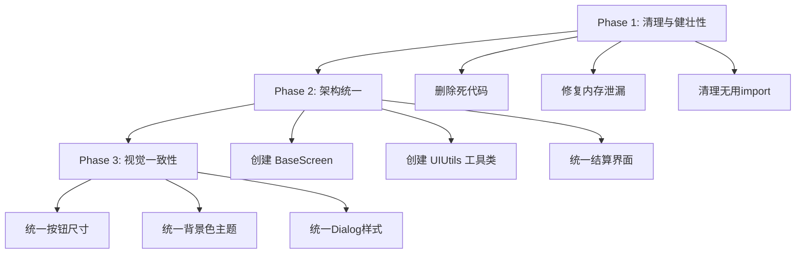

# 🎮 游戏UI/UX问题深度分析报告

> **分析范围**: 游戏界面以外的所有Screen（菜单、商店、设置、成就、关卡选择等）
> **分析日期**: 2026-01-07

---

## 📋 总览：问题分类

| 问题类型 | 数量 | 严重程度 |
|---------|-----|---------|
| Viewport不一致 | 7处 | 🔴 高 |
| 代码重复/架构问题 | 5处 | 🟠 中 |
| 用户体验问题 | 8处 | 🟡 中 |
| 视觉/样式不一致 | 6处 | 🟡 低 |
| 健壮性问题 | 5处 | 🔴 高 |

---

## 🔴 问题1: Viewport类型混乱（Critical）

### 现状

不同Screen使用了不同的Viewport类型，导致UI在不同分辨率下表现不一致：

| Screen | Viewport类型 | 分辨率 |
|--------|-------------|--------|
| `MenuScreen` | `FitViewport` | 1920x1080 |
| `SettingsScreen` | `FitViewport` | 1920x1080 |
| `LevelSelectScreen` | `FitViewport` | 1920x1080 |
| `AchievementScreen` | `FitViewport` | 1920x1080 |
| `ShopScreen` | `FitViewport` | 1920x1080 ✅ |
| `SkillScreen` | `FitViewport` | 1920x1080 |
| `VictoryScreen` | `FitViewport` | 1920x1080 |
| `GameOverScreen` | `FitViewport` | 1920x1080 |
| `LevelSummaryScreen` | `FitViewport` | 1920x1080 |
| `ArmorSelectScreen` | `FitViewport` | 1920x1080 ✅ |
| `StoryScreen` | `FitViewport` | 1920x1080 ✅ |

> [!IMPORTANT]
> 代码中发现**注释与实际代码不符**的严重问题！

#### 问题示例 ([ArmorSelectScreen.java:12](file:///Users/y.h/fopws2526projectfop-amazeing/core/src/de/tum/cit/fop/maze/screens/ArmorSelectScreen.java#L12))
```java
import com.badlogic.gdx.utils.viewport.ScreenViewport; // 导入了ScreenViewport
...
// 但实际使用的是FitViewport
this.stage = new Stage(new com.badlogic.gdx.utils.viewport.FitViewport(1920, 1080), ...);
```

### 影响

1. 点击区域偏移问题（Button Click Area Offset）
2. 多余的import导致代码混乱
3. 维护成本增加

### 建议修复

1. 统一所有Screen使用`FitViewport(1920, 1080)`
2. 清理无用的import语句
3. 创建一个`BaseScreen`抽象类统一管理Viewport创建

---

## 🔴 问题2: 资源管理内存泄漏风险（Critical）

### 现状

多处创建Pixmap/Texture后没有妥善管理dispose：

#### [AchievementScreen.java:69-76](file:///Users/y.h/fopws2526projectfop-amazeing/core/src/de/tum/cit/fop/maze/screens/AchievementScreen.java#L69-L76)
```java
private TextureRegionDrawable createColorDrawable(Color color) {
    Pixmap pm = new Pixmap(1, 1, Pixmap.Format.RGBA8888);
    pm.setColor(color);
    pm.fill();
    // ⚠️ Texture创建后没有被跟踪
    TextureRegionDrawable drawable = new TextureRegionDrawable(new TextureRegion(new Texture(pm)));
    pm.dispose(); // Pixmap被dispose了，但Texture没有
    return drawable;
}
```

#### 同样的问题出现在:
- [LevelSummaryScreen.java:419-429](file:///Users/y.h/fopws2526projectfop-amazeing/core/src/de/tum/cit/fop/maze/screens/LevelSummaryScreen.java#L419-L429)
- [ShopScreen.java:160](file:///Users/y.h/fopws2526projectfop-amazeing/core/src/de/tum/cit/fop/maze/screens/ShopScreen.java#L160): `skin.newDrawable("white", ...)` 每次调用都创建新Drawable

### 影响

1. 长时间运行后内存占用增加
2. 老旧设备可能出现OOM

### 建议修复

1. 将常用颜色Drawable缓存在工具类中
2. 在Screen的`dispose()`方法中释放所有创建的Texture
3. 使用Skin内置的方式管理Drawable

---

## 🟠 问题3: 代码重复 - ScrollPane自动焦点逻辑（Architecture）

### 现状

以下代码在**11个Screen**中几乎完全相同：

```java
scrollPane.addListener(new com.badlogic.gdx.scenes.scene2d.InputListener() {
    @Override
    public void enter(...) {
        stage.setScrollFocus(scrollPane);
    }

    @Override
    public void exit(...) {
        // Keep focus for better UX
    }
});
```

#### 出现位置:
1. [MenuScreen.java:208-220](file:///Users/y.h/fopws2526projectfop-amazeing/core/src/de/tum/cit/fop/maze/screens/MenuScreen.java#L208-L220)
2. [MenuScreen.java:486-498](file:///Users/y.h/fopws2526projectfop-amazeing/core/src/de/tum/cit/fop/maze/screens/MenuScreen.java#L486-L498)
3. [ShopScreen.java:106-118](file:///Users/y.h/fopws2526projectfop-amazeing/core/src/de/tum/cit/fop/maze/screens/ShopScreen.java#L106-L118)
4. [SkillScreen.java:155-167](file:///Users/y.h/fopws2526projectfop-amazeing/core/src/de/tum/cit/fop/maze/screens/SkillScreen.java#L155-L167)
5. [AchievementScreen.java:98-110](file:///Users/y.h/fopws2526projectfop-amazeing/core/src/de/tum/cit/fop/maze/screens/AchievementScreen.java#L98-L110)
6. [LevelSelectScreen.java:78-92](file:///Users/y.h/fopws2526projectfop-amazeing/core/src/de/tum/cit/fop/maze/screens/LevelSelectScreen.java#L78-L92)
7. [VictoryScreen.java:108-120](file:///Users/y.h/fopws2526projectfop-amazeing/core/src/de/tum/cit/fop/maze/screens/VictoryScreen.java#L108-L120)
8. [StoryScreen.java:60-72](file:///Users/y.h/fopws2526projectfop-amazeing/core/src/de/tum/cit/fop/maze/screens/StoryScreen.java#L60-L72)

### 建议修复

创建一个工具方法：
```java
public class UIUtils {
    public static void enableHoverScrollFocus(ScrollPane scrollPane, Stage stage) {
        scrollPane.addListener(new InputListener() {
            @Override
            public void enter(...) { stage.setScrollFocus(scrollPane); }
        });
    }
}
```

---

## 🟠 问题4: 重复的Screen生命周期管理

### 现状

所有Screen的`pause()`, `resume()`, `hide()`方法都是空实现：

```java
@Override public void pause() { }
@Override public void resume() { }
@Override public void hide() { }
```

### 影响

1. 代码冗余
2. 如果未来需要在这些方法中添加逻辑，需要修改所有Screen

### 建议修复

创建`BaseScreen`抽象类，提供默认实现

---

## 🟡 问题5: SkillScreen更新UI方式低效

### 现状 ([SkillScreen.java:230-238](file:///Users/y.h/fopws2526projectfop-amazeing/core/src/de/tum/cit/fop/maze/screens/SkillScreen.java#L230-L238))

```java
private void updateLabels(Label spLabel, Table table) {
    spLabel.setText("Skill Points: " + gameState.getSkillPoints());
    // ...
    stage.clear();  // ⚠️ 销毁整个Stage
    show();         // ⚠️ 重建整个UI
}
```

### 影响

1. 每次点击技能按钮都会重建整个界面
2. 用户体验卡顿
3. 不必要的内存分配

### 建议修复

保留对各个UI元素的引用，仅更新需要更新的Label文本

---

## 🟡 问题6: VictoryScreen和GameOverScreen功能重叠

### 现状

- `VictoryScreen` 和 `GameOverScreen` 都显示统计信息和成就
- 代码中已存在 `LevelSummaryScreen` 用于统一结算界面
- 但`VictoryScreen`仍然被使用（从`SkillScreen`返回时）

#### [SkillScreen.java:178](file:///Users/y.h/fopws2526projectfop-amazeing/core/src/de/tum/cit/fop/maze/screens/SkillScreen.java#L178)
```java
game.setScreen(new VictoryScreen(game, currentLevel));  // 仍在使用旧的VictoryScreen
```

### 影响

1. 玩家看到两种不同风格的结算界面，体验不一致
2. 维护成本翻倍

### 建议修复

完全使用`LevelSummaryScreen`替代`VictoryScreen`和`GameOverScreen`

---

## 🟡 问题7: 设置界面(SettingsScreen)布局问题

### 现状 ([SettingsScreen.java:220-227](file:///Users/y.h/fopws2526projectfop-amazeing/core/src/de/tum/cit/fop/maze/screens/SettingsScreen.java#L220-L227))

```java
private void addToKeyTable(Table table, String label, Actor actor) {
    table.add(new Label(label, game.getSkin())).right().pad(5);
    table.add(actor).left().width(100).height(35).pad(5);
    if (table.getCells().size >= 4 && table.getCells().size % 4 == 0)
        table.row(); // ⚠️ 条件判断逻辑有问题
    // 注释说明了存在疑问: "Wrap ? No. Let's do 3 columns? Or just flow."
}
```

### 影响

1. 按键绑定区域布局混乱
2. 开发者对自己的代码也不确定

### 建议修复

使用明确的Grid布局，每行固定3组按键绑定

---

## 🟡 问题8: 菜单注释错误和编号混乱

### 现状 ([MenuScreen.java](file:///Users/y.h/fopws2526projectfop-amazeing/core/src/de/tum/cit/fop/maze/screens/MenuScreen.java))

```java
// 1. Title
// 2. "New Game" Button
// 3. "Select Level" Button
// 4. "Random Map" Button   // ⚠️ 重复编号
// 4. "Load Game" Button    // ⚠️ 重复编号
// 4. "Settings" Button     // ⚠️ 重复编号
// 5. "Exit" Button
```

### 影响

代码可读性差，后期维护困难

---

## 🟡 问题9: 对话框(Dialog)缺乏统一样式

### 现状

不同Screen中的对话框样式不一致：

| Screen | Dialog样式 |
|--------|-----------|
| `ShopScreen` | 无标题Dialog + 2秒自动消失 |
| `LevelSelectScreen` | 有标题Dialog "Locked Level" |
| `MenuScreen.showLoadDialog` | Window class，不是Dialog |
| `MenuScreen.showSettingsDialog` | Window class |
| `MenuScreen.showRandomMapDialog` | Window class |

### 影响

用户体验不一致，每个弹窗的交互方式都不同

### 建议修复

创建统一的`DialogFactory`工具类，提供标准化的对话框创建方法

---

## 🟡 问题10: 按钮尺寸不一致

### 统计

```
MenuScreen:          300x60
LevelSelectScreen:   180x60, 200x50
SettingsScreen:      200x50, 100x35, 120x (宽不统一)
ShopScreen:          无固定宽高
AchievementScreen:   200x50
SkillScreen:         300x60, 200x60
VictoryScreen:       300x60
GameOverScreen:      300x60
ArmorSelectScreen:   300x40, 200x40, 120x40
StoryScreen:         300x60
```

### 影响

视觉层面的不协调感

### 建议修复

定义标准按钮尺寸常量：
```java
public static final float BTN_WIDTH_LARGE = 300;
public static final float BTN_HEIGHT_LARGE = 60;
public static final float BTN_WIDTH_MEDIUM = 200;
public static final float BTN_HEIGHT_MEDIUM = 50;
```

---

## 🟡 问题11: 背景颜色不一致

### 统计

| Screen | 背景色 (glClearColor) |
|--------|---------------------|
| `MenuScreen` | (0, 0, 0, 1) 纯黑 |
| `SettingsScreen` | (0.1f, 0.1f, 0.2f, 1) 深蓝 |
| `ShopScreen` | (0.1f, 0.1f, 0.15f, 1) 深灰 |
| `AchievementScreen` | (0.08f, 0.08f, 0.1f, 1) 接近黑 |
| `StoryScreen` | (0, 0, 0.1f, 1) 深蓝 |
| `VictoryScreen` | (0, 0.2f, 0, 1) 深绿 |
| `GameOverScreen` | (0.1f, 0, 0, 1) 深红 |
| `LevelSummaryScreen` | 使用纹理背景 |

### 影响

在Screen切换时产生突兀感

---

## 🔴 问题12: 潜在的空指针异常风险

### 现状

#### [SkillScreen.java:28-43](file:///Users/y.h/fopws2526projectfop-amazeing/core/src/de/tum/cit/fop/maze/screens/SkillScreen.java#L28-L43)
```java
this.gameState = SaveManager.loadGame("auto_save_victory.json");
if (this.gameState == null) {
    this.gameState = SaveManager.loadGame("auto_save.json");
}
if (this.gameState == null) {
    // 创建新的fallback，但后续代码假设gameState的某些字段已初始化
    this.gameState = new GameState(0, 0, currentLevel, 3, false);
    this.gameState.setSkillPoints(0);
    // ...
}
```

如果SaveManager在loadGame时抛出异常而非返回null，这段代码不会捕获异常。

---

## 🔴 问题13: MenuScreen showSettingsDialog 死代码

### 现状 ([MenuScreen.java:248-406](file:///Users/y.h/fopws2526projectfop-amazeing/core/src/de/tum/cit/fop/maze/screens/MenuScreen.java#L248-L406))

`showSettingsDialog()`方法是一个250+行的庞大方法，但**从未被调用**!

菜单上的Settings按钮实际跳转到`SettingsScreen`:
```java
settingsButton.addListener(new ChangeListener() {
    @Override
    public void changed(ChangeEvent event, Actor actor) {
        game.setScreen(new SettingsScreen(game, null));  // ← 使用的是单独的Screen
    }
});
```

### 影响

1. 死代码占用文件空间（250+行）
2. 如果修改设置功能可能修改错误的位置

### 建议修复

删除`showSettingsDialog()`方法

---

## 🟡 问题14: 关卡选择界面锁定关卡的密码明文硬编码

### 现状 ([LevelSelectScreen.java:123-135](file:///Users/y.h/fopws2526projectfop-amazeing/core/src/de/tum/cit/fop/maze/screens/LevelSelectScreen.java#L123-L135))

```java
if (input.equals(GameSettings.DEV_PASSWORD)) {  // 开发者密码暴露在代码中
    GameSettings.unlockLevel(level);
    // ...
}
```

### 影响

虽然是开发者密码，但安全性欠佳

---

## 📊 总结与优先级建议

### 🔴 High Priority（建议立即修复）

1. **清理无用import（ScreenViewport）** - 避免混淆
2. **修复资源内存泄漏** - 防止OOM
3. **删除MenuScreen中的死代码`showSettingsDialog()`** - 减少维护成本

### 🟠 Medium Priority（下一迭代修复）

4. **创建`BaseScreen`抽象类** - 统一Viewport管理和生命周期
5. **提取ScrollPane自动焦点为工具方法** - 减少代码重复
6. **完全用`LevelSummaryScreen`替代`VictoryScreen`/`GameOverScreen`** - 统一用户体验

### 🟡 Low Priority（有空时优化）

7. **统一按钮尺寸常量**
8. **统一背景颜色主题**
9. **统一Dialog样式**
10. **修复SettingsScreen按键绑定布局逻辑**
11. **优化SkillScreen的UI更新方式**

---

## 🎯 推荐实施路线



---

> [!NOTE]
> 本分析仅针对非游戏界面的Screen，游戏内的HUD和交互逻辑未在本次分析范围内。
